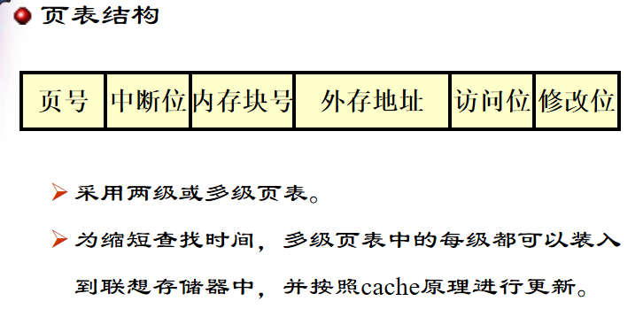

## 虚拟内存管理机制(带有中断的也是管理机制)
### 分类
  - 请求调页 缺什么调什么(这节课的重点)
  - 预调页 根据局部性原理，缺一页，调入和这一页附近的一顶数量页
### 最初动机
大程序小空间，发现挺好用的都用了
- 好处
    - 存放大程序
    - 提供大的用户空间(可用的虚拟内存空间大于物理内存)
    - 更多程序并发执行
    - 易于开发(与覆盖技术比较，不影响编程时的程序结构)
### 工作过程
- 装入时
    只需将当前需要执行的部分的页/段**部分**装入内存
- 执行中(三种情况)
    - 在内存中
    - 不在内存，页中断(界别最高的中断，CPU提出中断，OS处理进行中断响应)
        - 内存还有空间，装入
        - 内存没有空间，选一个页/段swap out，再装入(**中级调度**)
    磁盘中分为1. 交换区 2. 文件区
    - 扩充后的内存 = 物理内存 + 交换区
    - **虚拟内存是真实的物理存在**
    - 两种处理方法，第一种更常见
        - 双击后，放入整个放入交换区，交换的时候将换出的页/段换出到交换区，再将交换区要换入的页换入
            - 都是内存--交换区的交换，比较快，但交换区空间紧张
        - 双击后，整个还在文件区，换出的到交换区，但一开始可能是从文件区换入，比较慢但缓解了交换区空间紧张
### 特征
- 不连续性 离散
    - 物理内存分配的不连续性
    - 虚拟地址空间使用的不连续性
- 部分交换
- 大空间
    - 提供大范围的虚拟地址空间，其总容量不超过物理内存和外存交换区的容量
### 页式
- 页表结构

### 置换算法
- 考核过程
- FIFO先进先出
    - 简单
    - 抖动现象->频繁换入换出
    - Belady现象->给更多的页但不一定会有更好的效果
- OPT最佳算法(理想化)
    - 预测未来用未来不再使用的，在离当前最远位置上出现的
- LRU(least recent used)
    - 最常用
    - 利用历史预测将来，置换最长时间没有使用的页
    - 性能接近最佳算法
- LFU最不常用
    - 记录当前访问次数
    - 每一页都设置访问计数器
    - 页中断->换出计数最小的，并**将所有计数清零**
    - 若没有相同的，跟FIFO相同，一直都缺页一直清零，结合FIFO换出
- clock轮转算法
    - 采用一个指针，从当前指针位置开始按地址先后检查各页，寻找use=0的页面作为被置换页，并将指针经过的页修改为use=0 ，最后指针停留在**被置换页的下一个页**
### 虚拟存储策略
实际上有一个后台程序控制调出，保证内存有一定空闲率，保证换入的时候一定有内存空间
#### 调入策略
用于确定在外存中的页面调入**时机**
调入来源
- 交换区
- 文件区
##### 请求调页
只调入发生缺页时所需的页面
容易实现
对外存I/O次数多，开销较大
##### 预调页
发生缺页需要调入某页时，一次调入该页以及**相邻的几个页**
常用于**程序装入时**
提高调页的I/O效率
基于预测，若调入的页在以后很少被访问，则效率低
#### 调出策略
确定何时将已修改的页面调出到外存上
##### 请求调出
页面被置换时才调出
调入所缺页面之前还要调出，缺页进程等待时间长
##### 预调出
页被置换之前就调出，因而可以成批调出多个页
可能形成不必要的开销(调出了将要用到的页)
#### 常驻集和工作集策略
##### 常驻集
给进程**分配**的物理页面数量
确定方式
- 固定分配
    大小固定，平均分配、根据程序大小比例分配等等
- 可变分配
    大小可变，按照**缺页率**动态调整，性能较好，但增加算法运行的开销
##### 工作集
记录进程运行时需要的页面集合，从而**利用过去预测未来**，动态调整常驻集
困难
- 工作集的过去变化未必能够预示工作集的将来大小或组成页面的变化
- 记录工作集变化要求开销太大
- 对工作集窗口大小的取值难以优化，而且通常该值是不断变化的
#### 负载控制策略
研究内存中驻留多少个并发进程比较好，并不是越多越好，多了可能出现频繁缺页
### Linux系统中
#### 用户区
BUDDY算法，用一个链表数组记录连续空闲页面开始的页号，至于是连续的多少个用数组索引表示
`buddyPage[i] = 8`表示page 8开始有$2^i$个连续页面
#### 系统区
数据结构都确定了=>分区分配
SLAB算法：系统一启动就划分好哪个快放什么放多少
要用就不用申请内存，直接申请对象