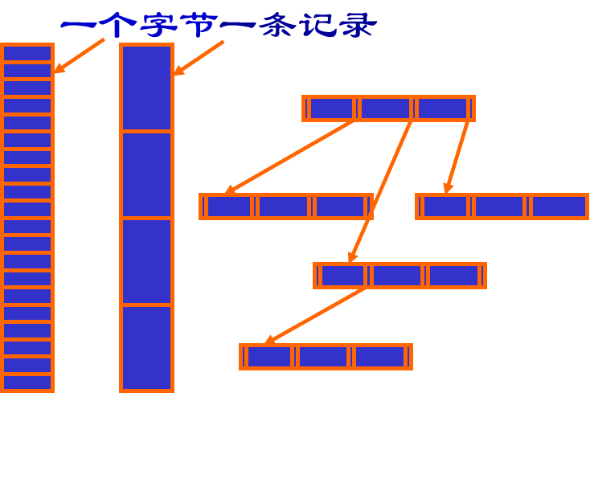
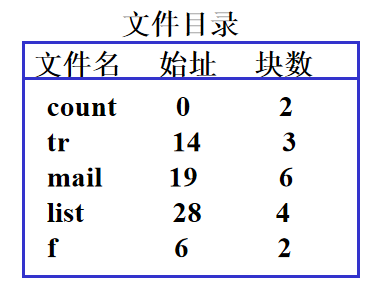
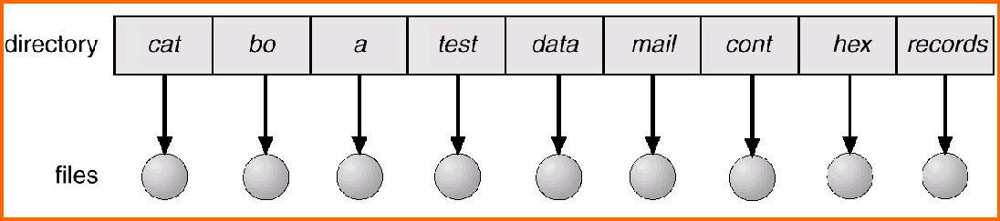
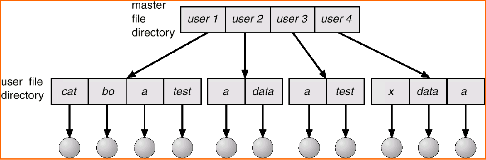
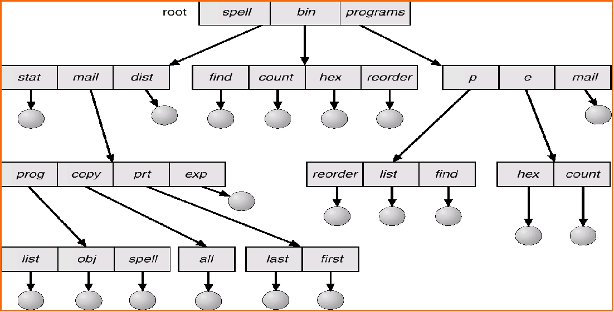
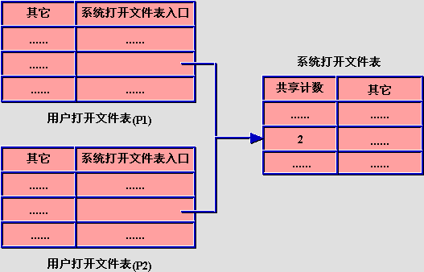

## 文件系统
### 基本概念
存储信息和检索信息
- 能够存储大量信息
- 长期保存信息
- 可以共享信息
解决方法
- 文件
    信息以一种单元，即文件形式存储在磁盘或其他外部介质上
    文件是一组带标识的，在逻辑上有**完整意义的信息项的序列**
    文件时通过操作系统来管理的，文件内容由文件建立者和使用解释
    
    属性
        - 名称
        - 类型
        - 位置
        - 大小
        - 保护
        - 时间、日期和用户标识
        - 等
    操作
        - create
        - write
        - read
        - reposition within file - file seek
        - delete
        - truncate
    文件类型
        分类目的
        - 对不同文件进行管理，提高系统效率
        - 提高用户界面友好性
        具体分类
        - 按信息保存期限分类
          - 临时
          - 永久
          - 档案
        - 按文件保护方式分类
          - 只读
          - 读写
          - 可执行
        - 按文件性质和用途分类
          - 系统文件
          - 用户文件
          - 库文件
        - **按文件的逻辑结构分类**
          - 流式文件
            构成文件的基本单位是字符，文件是有逻辑意义的、无结构的一串字符的集合。
            好处:提供很大的灵活性
          - 记录式文件
            文件是由若干个记录组成，是一个固定长度记录的序列，每条记录有其内部结构每个记录有一个键，可按键进行查找
        
        - **按文件的物理结构分类**
            其中的文件目录存在磁盘上才不会断电就没了
          - 顺序
            文件信息存放在若干连续的物理块中
            
            优点
                - 简单
                - 顺序存取、**随机存取**
                - 顺序存取速度快
                - 所需磁盘寻到次数和存到时间最少(磁道相邻/相同)
            缺点
                - 文件不同动态增长
                - 预留空间
                - 重新分配和移动不利于文件的插入删除
                - 外部碎片问题
                - 存储压缩技术
          - 链接(隐式)
            每个块末尾隐含指向下一个块的指针，-1标识EOF
            
            优点
                - 提高磁盘空间利用率，不存在外部碎片问题
                - 有利于文件插入删除
                - 有利于文件动态扩充
            缺点
                - 存取速度慢，不能**随机存取**
                - 可靠性问题，前面错了后面就没了
                - 更多寻道次数和寻道时间
                - 链接指针占用一定空间
          - 索引
            文件信息存放在若干不连续物理块中，系统为每个文件建立一个专用的数据结构**索引表**，并将这些块的块号存放在该索引表中
            一个索引表就是磁盘块地址数组，第i个条目指向文件的第i块
            
            优点
                - 能顺序也能**随机**
                - 满足了满足文件动态增长、插入删除要求
                - 充分利用外存
            缺点
                - 较多寻道次数和寻道时间
                - 索引表本身带来系统开销：内外存空间、存取时间
        
            一个块一个索引表，多个索引表 -> 链接/多级索引
            综合模式：一个块一部分存数据，剩下部分存索引
            
- 文件系统(对文件的管理手段)
  - 用户：如何呈现
  - OS：文件目录怎么实现、怎么管理存储空间、文件存储位置等
  - 作用
    - 实现文件的按名存取，按名字检索：用户->名字->file_id，用户起名的时候基本不用考虑重名
    - 实现文件信息的共享，并提供文件保护和保密措施
    - 向用户提供方便使用的接口
    - 系统维护及向用户提供有关信息
    - 文件系统的执行效率
    - 提供与I/O的统一接口
注：文件与文件系统只是一种解决方法
### 文件结构
- FCB 文件存在的标志
  文件控制块是操作系统为管理文件而设置的数据结构，存放了为管理文件所需的所有有关信息（文件属性）
- FCB内容
  - Name
  - Type
  - Address
  - Current length
  - Maximum length
  - ...
### 目录结构
- 文件目录
  把**所有FCB组织**在一起，构成文件目录，即文件控制块的有序集合
- 目录项->就是FCB
- 目录文件
  通常将文件目录以文件形式保存在外存，这个文件就叫目录文件
- 目录结构分类
  - 一级目录
    
    - 优点：简单易实现
    - 缺点：命名问题、逻辑组
  - 二级目录
    
  - 树形目录(多级目录)
    
  - 其他
    - 哈希
    - B+树
- 文件访问方法
  - 目录检索
    - 用户给出文件名，按名寻找目录项
    - 根据路径名检索
    - 全路径名：从根开始
    - 相对路径：从当前目录开始
  - 文件寻址
    根据FCB中文件物理地址等信息，求出文件的任意记录或字符在**存取介质上的地址**，称为文件寻址。
- 目录改进
  - 目的：加快目录检索
  - 方法
    - 目录项分解：symbol FCB(文件名、文件号...) & basic FCB(文件名所有信息)
    - 例如UNIX中的i节点
    - 目录能装更多的目录项，更少磁盘I/O
### 空闲空间管理
- 空闲块表
- 空闲块链表
- 位示图
- 成组链接法
### 文件系统实现
- 数据结构
  - 系统文件表，整个系统一张放在内存
    保存已经打开的文件的FCB文件号，共享计数，修改标志
  - 用户文件表，每个进程一个
    记录用户打开文件表的位置，文件描述符，打开方式，读写指针，系统打开文件表入口
    指针连接到系统文件表
  
### 可恢复性问题