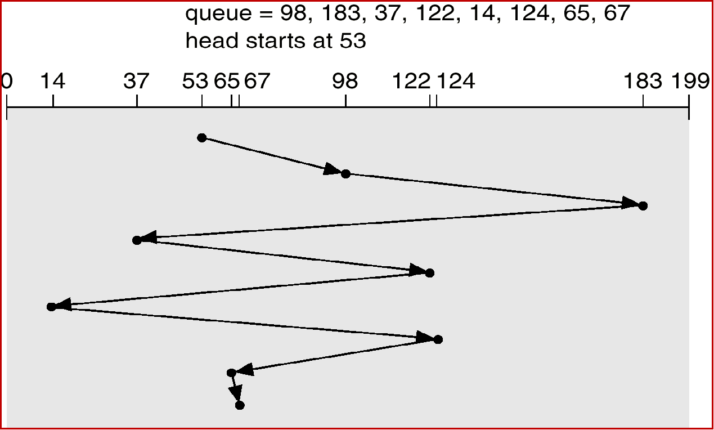
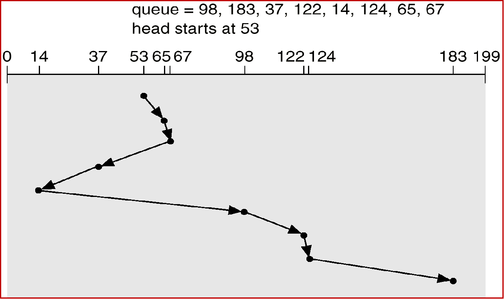
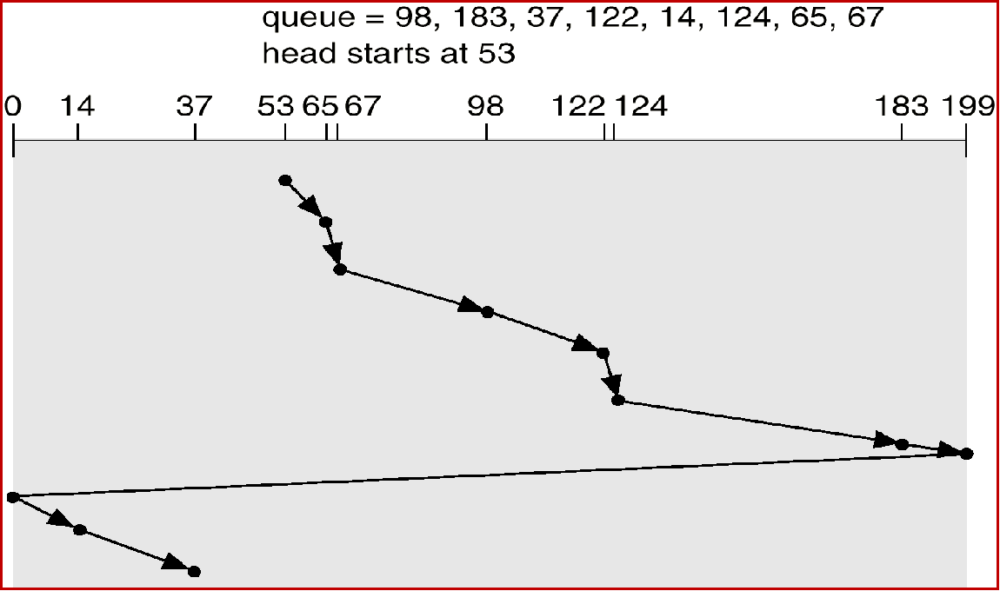
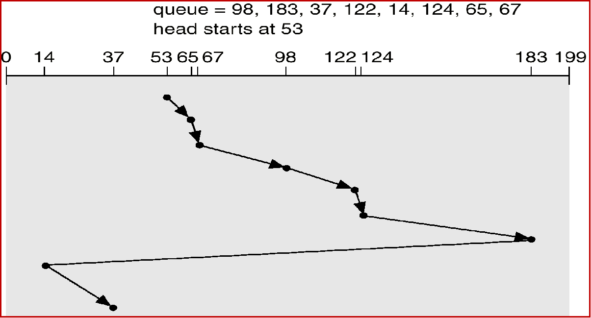

## 磁盘管理
### 磁盘结构
#### 外存
关心**速度、可靠性**
特点
    - 容量大、断电后可保存信息，速度较慢
    - 组成部分：驱动部分(外设) + 存储介质
    - 种类很多
    - 外存空间组织和存取方式复杂
存储介质
    - 磁带
      - 永久保存大容量数据
      - 顺序存取设备
      - 存取速度较慢，主要用于后备存储
    - 磁盘
      - 随机存取设备
      - 磁盘认为数据块的物理地址三维的：盘面号、磁道号、扇区号
        - 磁道：圆形轨迹，磁道之间有间隔防止干扰
        - 扇区：圆形轨迹的弧段
      - 但OS认为数据块的物理地址最好是一维的：第几块就好
    - 光盘
      - 容量大、速度块、价格便宜
      - 一般不可写，可写的很贵
      - 空间结构与磁盘类似
    - 硬盘分类
      - 固定头磁盘
        每个磁道设置一个磁头，变换磁道时不需要磁头的机械移动
        成本高速度快
      - 移动头磁盘
        一个盘面只有一个磁头，变换磁道时候需要移动磁头
        成本低速度块
      磁头：感应磁介质的方向，转换为电信号
磁盘读取时间
    要改进先减少前两个的时间
    - 寻道时间
        机械运动，时间最长，磁头定位到指定磁道
    - 旋转延迟
        指定扇区从磁头下旋转经过
        - 转速，极限了目前
        - OS不按顺序编号，转到i了读了之后再读以为是i+1结果是i+2
    - 数据传输
        存取，与磁盘无关了
#### 使用要求
- 用户对外存的使用：读写外存数据
- 用户对外存的要求：方便、效率、安全
  - 不涉及硬件细节
  - 速度尽可能块，空间利用率高
  - 存放信息安全可靠
  - 方便共享、动态扩缩、携带拆卸
  - 尽可能小代价
#### 磁盘调度
目的
    - 公平性，一个I/O请求在有限时间内满足
    - 高效性：减少设备机械运动花费时间
方法
    - 先来先服务(FCFS)
        按访问请求到达的先后次序服务
        优点：公平简单
        缺点：效率不高，相邻两次请求可能造成最外的柱面寻道，使磁头反复移动，增加了服务的时间，对机械不利
    
    - 最短寻道时间优先(SSTF)
        优先选择距当前磁头最近的访问请求进行服务，主要考虑寻道优先
        优点：改善了磁盘平均服务时间
        缺点：造成某些访问请求长期等待不到服务
    
    - 扫描算法(电梯算法，双向扫描)
    
    - 单向扫描算法
    
### 磁盘管理
#### 格式化
#### 引导区
#### 坏块 
### 可靠性
#### 容错技术
磁盘容错技术：通过增加冗余的磁盘驱动器，磁盘控制器等来提高磁盘系统可靠性
廉价磁盘冗余阵列RAID