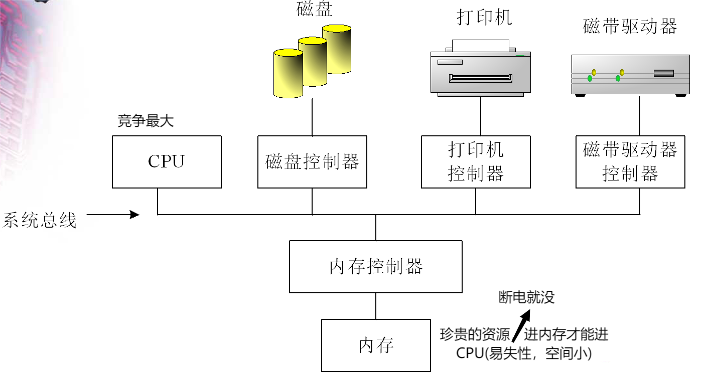

### 不懂是什么
- 外设->内存->CPU->内存->外设
- 调度：OS送任务进入CPU(调度方法很重要，是整个CPU工作的核心)
- 上下文环境：程序运行所需要的数据，任务进入CPU寄存器前要带上
- 上下文切换：任务切换，环境也一起切换(切换太频繁，浪费CPU)
- 文件系统：是怎么找磁盘中的东西->起名->展示出来
- OS将所有外设设备当作一种外设
- 使用外设：模型 + 设备驱动程序(也是管理程序，级别比普通应用程序高，套到OS称为OS的一部分)
- 磁盘：块设备(需要传输的数据量很大)
- 键盘、鼠标：字符设备(I/O传输过程中以字符为单位进行传输的设备)
- 希望慢速的外设和快速CPU能速度匹配，多个外设也能并发进行
- 中断：停下正在进行的任务去做别的任务，做完再回来继续
- 保存旧现场(存在内存，因为寄存器要存在新的上下文环境)

#### I/O 方式
- 同步：请求发出，CPU中断现在的任务，等外设搞好了才能继续工作
- 异步：请求发出，快速响应，CPU接着做自己的任务，外设搞好了再通知CPU一声
    - CPU和外设按各自的节奏工作
#### I/O技术
- Programmed I/O，PIO
    - CPU定期轮询状态(插电没有、开电源没有...) -> 空循环、忙等待
    - CPU等待慢速的外设传输(慢速外设制约快速CPU)
    - 占用CPU时间：查询 + 传输
- 中断机制
    - CPU不主动查询外设状态了，让外设通知CPU(中断请求)
    - 通过**中断控制器**处理中断请求
    - 但传输过程仍然占用CPU时间
- 直接内存存取DMA
    - 增加DMA控制器，控制I/O和内存之间的数据传送，CPU就不用花时间在传输过程上
    - 只用开始结束两个中断请求，告诉CPU准备好了和结束了
    - 虽然有中断但中断过程变小了
- 通道技术
    - 多出来一个CPU专门用来处理I/O
    - 提高并行度(多核)
    - 用于集成度高的

#### 主流还是上述中间两种方式
- 字符设备(键盘鼠标)：数据量小，采用中断机制
- 块设备：数据量大，采用DMA

#### 存储结构
- 在两种介质之间增加的都叫**缓冲区**
- 容量、速度、成本
- 内存问题
    - 怎么放
    - (主要目标)放在哪，使得空间利用率尽可能高
- 磁盘问题
    - 怎么放
    - (主要目标)放哪里，使得读取数据尽可能快
- 有一种设计，在内存中划一块区域当磁盘，虚拟内存盘
    - 觉得内存足够大，想提升存取速度
- 还有一种设计，在磁盘中划一块区域swap当内存
    - 觉得内存不够大，虚拟内存

#### 硬件保护
- 双重操作模式
    - 用户模式、内核模式
    - 用户模式陷入内核模式
    - 当计算机系统执行用户应用时，系统处于用户模式。However,当用户应用通过系统调用，请求OS服务时，系统必须从用户模式转换到内核模式，以满足请求。
    - 双重模式为操作系统提供了保护手段，以防止操作系统和用户程序受到错误用户程序的影响。将可能引起损害的机器指令作为特权指令（可能引起系统奔溃的指令，只能运行在内核模式），并且硬件只有在内核模式下，才允许执行特权指令，如果在用户模式下，硬件不会执行特权指令请求并且还会当作陷阱形式通知操作系统。用户程序需要使用特权指令时，就需要通过系统调用，回到内核态。像I/O控制、定时器管理、中断管理和切换到用户模式等指令都是特权指令。控制权从用户模式回到内核模式的方法有中断、陷阱和系统调用。
    - 当要执行系统调用时，硬件通常将它作为软件中断。控制通过中断向量转到操作系统的中断服务程序，并且模式位也设定为内核模式。系统调用服务程序请求何种服务。请求所需的其他信息可以通过寄存器、堆栈和内存（内存指针也可以通过寄存器传递）来传递。内核首先验证参数是否合法和正确，然后执行请求，最后控制返回到系统调用之后的指令。
- I/O保护
    - 所有I/O指令都是特权指令
- 内存保护
    - 设置两个寄存器，基址寄存器、界限寄存器，保证访问合法
- timer定时器，CPU保护
    - 定时器每过一个时钟周期递减一次，当定时器的值为0时，产生*定时的*中断
    - 一个滴答作为计量单位，控制使用CPU的时间(可用于分时系统)

graph structure learning（重点写） 放到GNN中
大规模的图的结构，规模越大越好
吹牛逼，应用场景，从例子入手介绍这个东西，知识图谱、推荐系统（说的时候套个壳）
软件老师没什么懂的，刘琴懂点点，但是偏应用