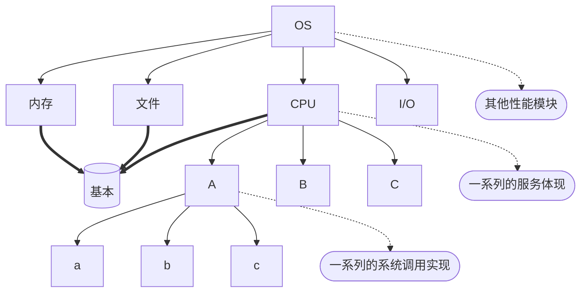
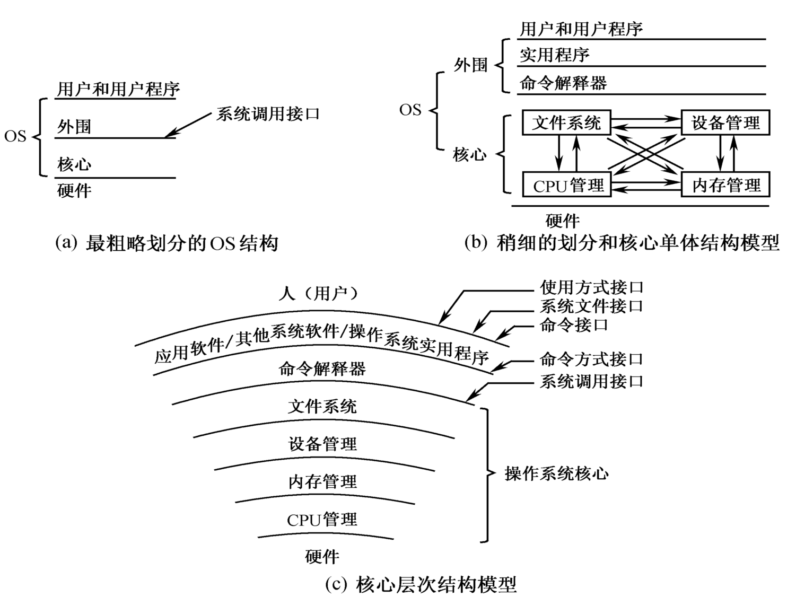
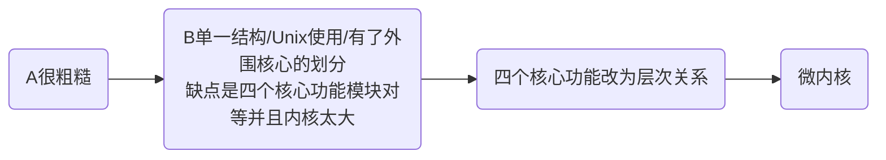
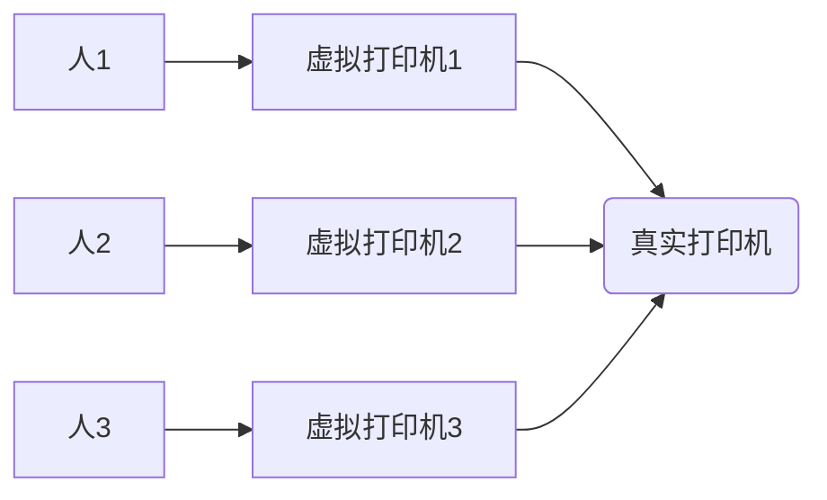
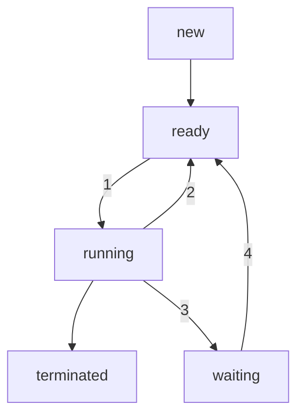

## 不用读书，不要陷入
- 本章体会OS做什么事

### 进程管理(CPU管理)
- 进程是程序的执行，是运行着的程序，一定独立功能的程序，在一定数据集合上的运行活动
- 进程需要一定的资源，如CPU时间、内存、文件和I/O设备等
- 作业 JOB 粒度大 eg.数学作业、语文作业
- 进程 PROCESS 粒度小一点 eg.数学做的题目
- 线程 THREAD 粒度更小的 eg.题目中的小题，小题共享题目中的题干(线程会共享进程中的资源，并且线程是依赖于进程而存在)
- 粒度越来越小，更加方便提升**并发性**
- 进程活动管理
  - 创建和撤销进程
  - 挂起和唤醒进程
  - 进程同步机制
  - 进程通信机制
  - 死锁处理机制

### 内存管理
- 内存是**易失性**存储设备
- 相关活动
  - 记录哪部分正在被使用，被谁使用
  - 决定那些可以装入内存
  - 根据需要分配和释放空间

### 辅存管理
- 文件系统是主流的一种管理方法
- 由于内存太小不能容纳所有数据和程序，加之断电后失去数据
- 相关活动
  - 空闲空间管理
  - 存储空间分配
  - 硬盘调度

### 文件管理
- 相关活动
  - 创建和删除文件
  - 创建和删除目录
  - 提供操作文件和目录的原语
  - 将文件映射到二级存储器(辅存)上
  - 在稳定的存储媒介上备份

### I/O管理
- 包括缓冲器、高速缓存等
- 一个通用设备驱动程序的接口
- 用于特定硬件设备的驱动程序

### 系统调用
- 进程与OS的接口
- 系统调用向OS传递参数方法
  - 寄存器传递参数
  - 内存的块/表，传递内存地址
  - 参数放入堆栈中

### OS按照逻辑功能模块划分


### 区分执行和运行
- 执行是文件的双击，放入内存
- 运行是进入内存且在CPU上跑起来




始终是核心和外围的边界划分角度的演变
### 微内核
- 只把CPU管理、内存管理等一些基本功能放进内核
- 不是完整的OS
- 微内核结构是以微内核为os核心，以客户/服务器为基础，采用面向对象程序设计特征，是当今最有发展前途的OS结构
- 环境子系统向应用程序提供环境和应用程序编程接口。作用是将基本的执行体系统服务的某些子集提供给应用程序。用户应用程序调用系统服务时必须通过一个或多个子系统动态链接库作为**中介**才可以完成。由此OS提供各种APP的兼容性

### Virtual Machine
- 用软件方法模拟机器硬件(大多数)和软件，从而提供了与基本硬件相同的接口
- 让用户感觉自己独占了资源

- 优点
  - 通过完全保护系统资源，虚拟机提供一个坚实的**安全层**
  - 虚拟机允许进行系统开发而**不必中断**正常的系统操作
- 缺点
  - 很难提供真实的硬件效果

### OS设计目标
- 用户
  - OS应该便于使用(方便性)
  - 易于学习
  - 可靠
  - 安全与快速
- 系统
  - 易设计、实现和维护
  - 应该灵活、可靠、没有错误且高效

## 进程基础
- 内存中，容器(空间)，各自独立，OS帮助进程之间的交互
- $PROCESS\begin{cases}
    \text{PCB(记录特征，区别进程)} \\
    \text{program} \\
    \text{data section} \\
    \text{stack} \\
    \end{cases}$

### DIFFERENCE Between PROCESS & PROGRAM
- 组成
- 生命周期
- 动态静态(进程的不同状态)
- 进程具有创建进程的功能
- 并发描述
- 并不是一一对应

### STATUS of PROCESS
- 就绪：资源只差CPU(只有一个队列)
- 等待：资源没满足(数据、CPU...)(多条队列，例如等待的资源不同)
    - 阻塞：一般说的等待
    - 挂起：运行一段时间了，OS决定将其从内存空间挂去磁盘上
- 运行: 一般只有一个，(对应CPU个数)
- 新建：内存开辟一块空间给该进程
- 终止：内存释放空间

### 进程之间的关系
- 竞争 -> 调度(最简单)
- 协作 -> 同步(有内在联系，进程之间独立，自身处理不了，OS来帮忙，最复杂)
- 通信 -> (OS帮助交互)

### 状态的转换
- 五个状态转换图

- OS在其中响应

- ready -> running的事件
  - 当前执行的进程完成
  - 中断当前优先级低的进程
  - 当前进程时间片到了(分时系统)
  - 当前运行到一半资源不满足(运行到某个指令需要打印机，但没准备好)
- running -> ready
  - 时间片到了
  - 优先级不够，被中断
- running -> waiting
  - 中途缺少资源
- **注意**
  - 没有waiting -> running：对ready队列的不公平
  - 没有ready -> waiting：已经获得的资源不会丢，不然重复申请资源
  - 新建的到直接到就绪，然后运行了才知道缺不缺资源

### OS怎么处理
- 对于状态变化1
  - 使用调度程序，要干**两件事**
    - 从就绪队列中选择一个进程according to调度算法
    - 上下文切换(PCB)(CPU中的拿出来，选中的放进去)
      - 切换的数据量，即PCB的大小也有讲究(太少速度快，但信息不够充分)
- 对于状态变化234
  - 使用控制程序(调度程序就是控制程序的一个特例，因为1变化非常频繁)

### PCB的设计
- 设计数据结构，Linux中一般一千多字节
- 其中前四个就是*控制进程相关*

| PCB数据结构 |
| :---------: |
| PID |
| 状态 |
| 调度相关 |
| 其他控制相关 |
| 相关内存信息 pointer指向内存 |
| 相关文件信息 pointer指向磁盘 |

### 一般将空间分为两部分，用户区和系统区
- 作用
  - 将数据信息更好分类
  - 不让用户干扰系统工作
- 其中PCB就是放在系统区(进程中的其他信息就不是了)
  - 系统把所有PCB组织在一起，并放在**内存固定区域**，就构成了**PCB表**
    - 固定：固定大小位置的一块内存区域
    - 形成一条条队列链表的形式，等待队列、就绪队列...
  - PCB表大小决定了系统中**最多可同时**存在的进程个数，称为系统的**并发度**

### 进程调度类型
- 高级调度(作业调度、宏观调度)
  - 时间尺度为分钟、小时或天
- **中级**调度
  - 内外存交换，简称**交换**
  - 选一个或多个挂起，解决内存紧张问题
  - 注意交换的是进程，而不是数据文件
- 低级调度(微观调度)
  - CPU，内存之间
  - 模式，看是否允许高优先级的强制中断CPU正在运行的进程，然后换自己进去
    - 非剥夺
      - 简单
      - 开销小
      - 实时性差
    - 剥夺
      - 优先级原则(被动让出)
        - 缺点：存在优先级低的一直得不到CPU -> 饥饿状态
        - 解决：根据等待时间，逐渐提高优先级
      - 时间片原则(大多数常用，公平，主动让出)
  
### 进程控制
- 控制原语：**原子性**，太重要了，不可再分
- 例子：
  - 创建进程原语create()
  - 挂起原语suspend()
  - 激活原语active()：将挂起的进程从磁盘放回内存，状态：挂起 -> 等待(挂起的是一直等待不能执行的)
- 创建
  - 方式
    - 系统程序模块统一创建
    - 父进程创建
  - 内容
    - 申请(**系统区**内存空间)并创建PCB
    - 给PCB统一进程标识符PID
    - 给进程映像分配空间(**用户区**)
      - 映像：进程在内存空间的分布
      - 系统区的空间那么小都申请下来了，这里更倾向于成功申请，于是有后台程序保证其成功，若空间不够，把一些等待很久的进程挂起，缓解内存资源紧张的问题
    - 初始化PCB
    - 设置相应链接，如新进程加入就绪队列
### 父子进程
- 子进程会继承父进程的数据信息等，之后运行了也会有自己的数据
- 更喜欢创建子进程的形式：数据等等用指针指向父进程的数据，而不是copy一份，更节省内存
- 在父子进程之间，OS会优先让子进程执行
- fork的例子
  - 一次调用，二次返回
  - 父进程返回一次PID，子进程返回一次PID
  - 是谁的PID呢，由调度程序决定
  - 我们只是根据PID判断是哪个进程，从而进行不同操作
    ```mermaid
    graph LR
      father_old --fork--> father_new
      father_old --fork--> son
    ```
  ```puml
  scale 300 width

  state MEMORY {
    process_son_PCB --> process_father_PCB

    process_son_PCB: 自己的数据\n----\n指向父进程数据的指针
    process_father_PCB: 数据信息等等\n--~~--\n--~~--\n--~~--
  }
  ```
  - 进程树型结构
  ```puml
  @startwbs
  + root
  ++ pagedaemon
  ++ swapper
  ++ init
  +++ user1
  +++ user2
  +++ user3
  @endwbs
  ```
### 进程协作
- 分类
  - 没关系-->竞争
  - 有内在关系
    - 协作方式
      - 同步
      - 互斥
    - 司机开车前要检查(协作)售票员关车门没
      - yes: 运行
      - no: 等待，由调度算法选择一个两个进程直到选择到售票员进程并且完成关门操作了，司机进程才去就绪状态等CPU
  - 有意为之的关系
    - 通信
    - 没那么重要，不是OS的微内核的功能
- 进程同步
  - 同一节奏，“串行”，有前后次序的制约关系
  - 本质并发进程是共享**对方的私有资源**而引起的直接制约
- 进程互斥
  - 进程竞争**共享共有资源**(第三方的资源)而引起的间接制约关系
  - 利用*锁*🔒
  - 例子：两个进程都要用同一台打印机(互斥性、排他性)
  - 检查锁是否打开
    - 没开：等待
    - 开了：获得资源、关锁(不让其他资源占用)(注意这时候只是获得了一个资源，CPU和其他资源有没有不一定的)

### 进程通信
- 进程各自独立，不能自主通信，需要OS提供方法和程序员编写程序帮助
- 没那么重要，不是OS的微内核的功能，在外围
- 分类
  - 低级通信：只能传递状态和整数值
    - 传送信息量小：效率低，每次通信传递的信息量固定，若传递较多信息则需要进行多次通信
    - 编程复杂：用户直接实现通信的细节，编程复杂，容易出错
  - 高级通信：能够传送任意数量数据
    - 共享内存
      - 在内存*用户区*开辟一段共享区间，需要通信的数据可以从$P_1$copy到共享区间，然后再把共享区间中的数据copy到$P_2$
      - 一次通信至少两次copy
      - 存在关于读写的进程写作问题需要程序员处理，对该内存区写是排他的，一个时间只能一个进程写入，程序员觉得很麻烦
      - 根据共享区间大小
        - 基于**共享数据结构**的通信方式
        - 基于**共享存储区**的通信方式
    - 信息传递系统
      - 最广泛的通信机制
      - 两种类型
        - 直接通信
          - 消息缓冲通信方式
          - 发送进程直接把消息发送给接受进程，把消息挂在接受进程的消息缓冲队列上，接受进程从消息缓冲队列中取得消息
        - 间接通信
          - 信箱通信方式
          - 进程之间的通信需要通过作为共享数据结构的实体。该实体用来暂存发送进程发给目标进程的消息
          - OS提供系统调用`send() receive()`
          - send() 将发送进程的数据copy然后*封装规范化*为数据结构'消息'，存储在内存*系统区*
          - reveive() 将系统区的消息中的数据copy给接收进程
    - 管道
      - 不想浪费内存，于是共享磁盘上的文件，文件作为缓冲传输介质
      - 利用一个系统调用声明一个管道文件，对文件的读写交给文件系统
      - 在磁盘上的：有名管道
      - 觉得太慢了，将共享文件放进内存，还是用管道的方法、文件的操作：无名管道
- 比较
  - 共享内存比消息传递更快
    - 不用封装数据结构
    - 不用陷入内核态(系统调用)
  - 共享内存比无名管道更快
    - 同上
  - 但程序员更倾向于简单的、方便的，交给OS系统调用/文件系统处理进程协作问题