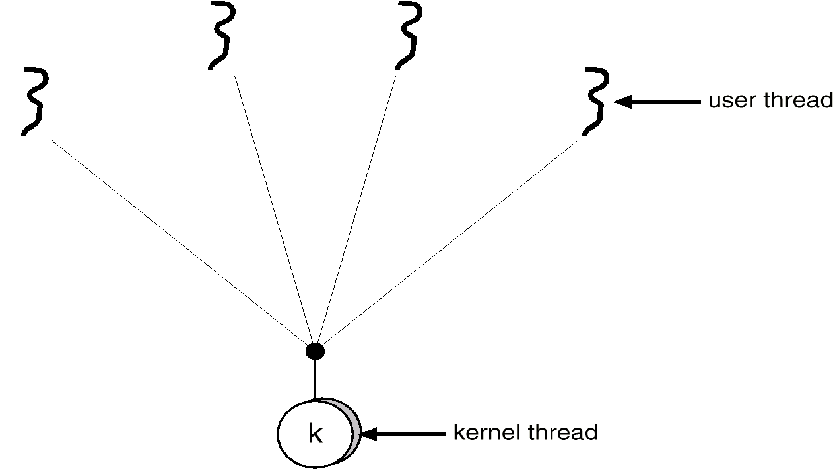
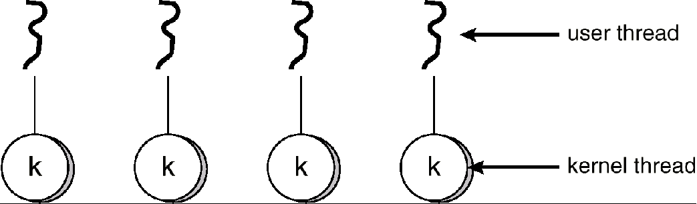
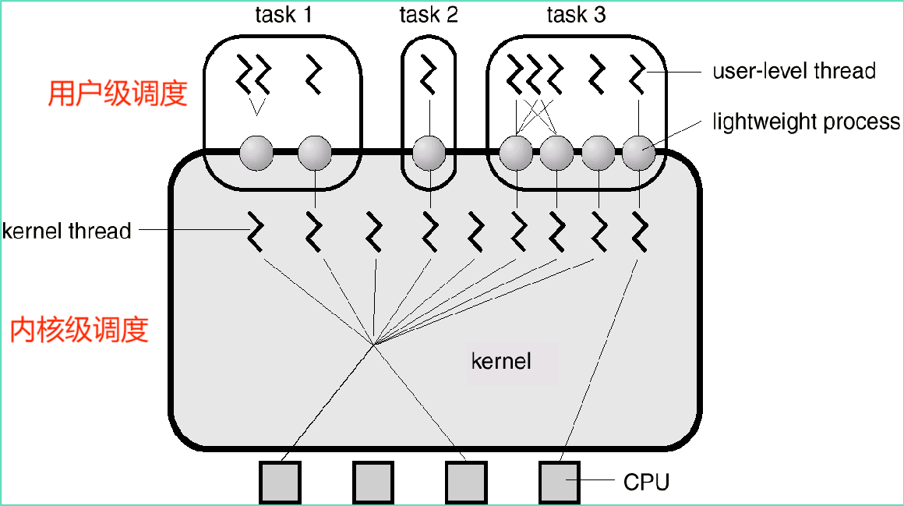

### 线程引入
- Task放入CPU本来也是顺序、串行执行，我们发掘其内部并发性(能否分开执行不影响)，变成一个个进程，线程同理而来
- process之间一般没太多联系，但thread之间往往有密切联系，毕竟不能独立存在，依赖于进程，共享了进程的资源
- 一个CPU将作业分为多个process已经可以实现很好的并行性了
- 软件先行，考虑多个CPU，多个process就不够CPU忙起来，于是进一步细分为thread
- 进程的两个基本特性
    - 资源分配的独立单位(不变)
    - 调度的基本单位(待更新...)
    => **线程为调度的基本单位**
- 将进程的程序段分段分为多个执行点
```puml
process: 资源\n程序段1\n程序段2\n...
```
- 定义
  - 轻量级进程：基本上没有资源
  - 进程中的一个运行实体、执行单元、执行体
  - CPU调度基本单位
  - 可以由内核控制，也可以由用户控制
- 组成
  - 不拥有系统资源，存取所在进程中的内存和其他资源
  - 只包含一些程序计数器、寄存器和一组栈
  - TCB(记录线程执行状态)
    | TCB |
    | :---: |
    | TID |
    | 状态信息 |
    | 调度信息 |
    | 等等 | 
  - 不运行时保存上下文
- 调度更加复杂，因为切换上下文(资源环境)的问题，$P_1.T_1$执行完了接在在$P_1$里面选，而不是$P_2$里面选线程
- 状态 和进程差不多
  - 创建状态
    - 创建
    - 线程创建线程
  - 阻塞状态
    - 处理器调度其他线程
  - 唤醒状态
  - 完成状态
    - 释放占用的寄存器上下文和栈空间
- 线程模式
  - 分类
    - 单进程，单线程 淘汰
    - 单进程，多线程 淘汰
    - 多进程，一个进程一个线程
    - 多进程，一个进程多个线程 good
  - 三多模式
    - 多用户 多进程 多线程
      - 一个用户有多个进程，一个进程有多个线程
- 线程的好处
  - 资源开销
    - 进程占用资源多，开销大
    - **一个进程内**多个线程共享地址空间以及大部分数据
    - 启动空间花费小
    - 切换时间花费小
      - 说的是**一个进程内的不同线程的切换**否则不仅要切换上下文环境，还要调度目标进程中的某一个线程
  - 通信开销
    - 不同进程之间通过*通信方式*的费时，不易实现
    - **同一个进程**的不同线程间共享，且无需调用内核，但有需要考虑协作关系
- 实现机制
  - 用户级线程
    - 利用线程库，在不支持线程的OS上，让用户认为有线程，实际上进入CPU的还是进程
    - 用户认为的T1/T2/T3...选择交给应用程序的**用户级调度**(不同应用程序有不同的调度算法)，交给OS，然后OS的**内核级调度**(统一的调度算法)再选择交给CPU
    - 实际上OS调度的还是进程
    ```puml
    @startuml
    allowmixing
    class OS
    rectangle thread_pool {
      Thread2 --> OS
      Thread3 --> OS
      Thread1 --> OS
    }
    

    OS --> Process1
    OS --> Process2

    Process1 --> CPU
    Process2 --> CPU

    note right of Thread3: 用户希望线程尽可能多 
    @enduml
    ```
    - 优点
      - 线程切换不用调用核心
      - 调度算法由应用程序特定提供
      - 运行在任何操作系统(只要有线程库)
    - 缺点
      - 进程阻塞，其中的线程都阻塞
      - 一个进程内的不同进程不能同时跑在不同处理器
  - 内核级线程
    - 真的线程
    - 优点
      - 一个进程中的不同线程可以跑在不同处理器
      - 阻塞是线程级别
      - 核心例程多线程
    - 缺点
      - 线程切换调用内核，速度下降
  - 两者结合
    - Many-to-One
    
    - Many-to-Many
    
    - One-to-One(Linux 采用)
    
    - 多种结合
    
    - 注意没有One-to-Many，真正的线程很宝贵