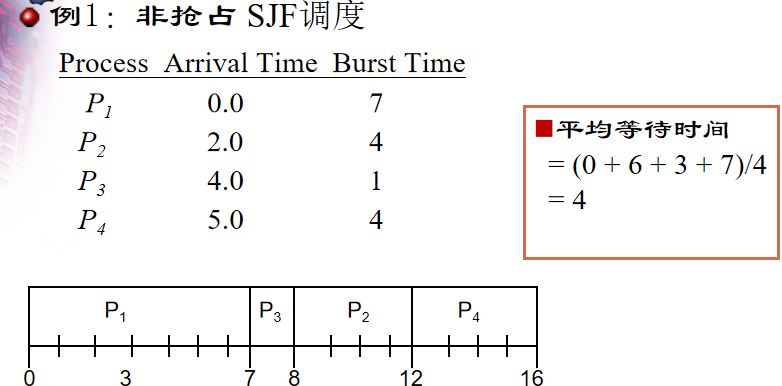
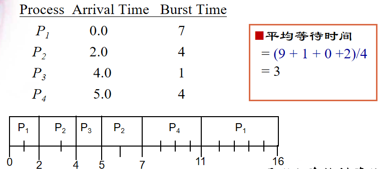
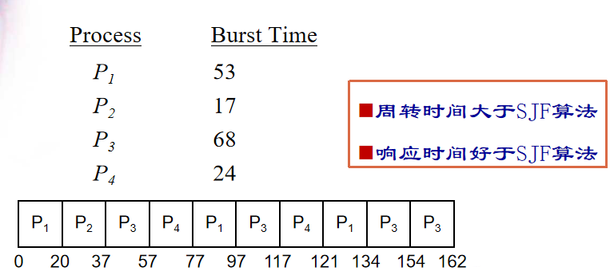
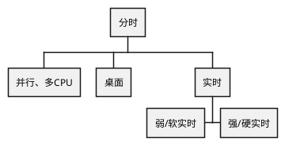

## CPU调度
### 基本概念
- 调度两件事
    - 选一个or多个
    - 切换(分派程序dispatcher copy PCB/TCB)(Reg <--> Mem)
- 任务分类
    - 计算型(CPU型)任务：主要想要CPU
    - I/O型任务：主要用外设，用CPU很少
- 希望两种任务都有，CPU区间和I/O区间交替序列，系统性能好，IDEALISM
- 事件发生后希望决策尽可能快(程序短小精悍)，否则浪费CPU，不一定最优
- 分派延迟：停止一个进程然后启动另一个进程所需要的时间
- 衡量标准
    - CPU利用率
    - 吞吐量
    - 周转时间(不好，不确定)
    - 等待时间：进入第一次就绪队列到完成所呆在就绪队列的时间总和
    - 响应时间：进入就绪队列到第一次上CPU的时间
### 调度算法
- 根据下述属性作为调度算法的依据
    P(到达时间, 完成时间(预估需要), 截止时间, 重要度(一般为数字))
- 发展历程
    - FCFS, 最简单朴素
        - 优点：简单
        - 缺点：性能与到达顺序密切相关，片刻的到达顺序差异导致性能大差别
    - SJF，有算法的思想在里面了
        - 理论上(使用预估需要的完成时间)平均等待时间最小的，最佳的算法
        - 从此有抢占式/非抢占式之分
        - 抢占式平均等待时间更少，但切换上下文(也会花费时间)较多
        
        - 时刻7，进程$p_1$执行完成，CPU空闲，而$p_2, p_3, p_4$处于就绪状态，其中$p_2$的预估完成时间最短，因此调度进程$p_2$
        
        - 时刻2，进程$p_2$进入就绪队列需要完成时间2，对比正在执行的进程$p_1$仍需要完成时间5，进程$p_2$所需时间更短，调度算法让其抢占CPU
        - 时刻4，进程$p_2$执行完成，就绪队列中有进程$p_1$还需要时间5、进程$p_3$还需要时间1，调度算法选择所需时间更短的进程$p_3$
    - 优先级调度，对前两种算法进一步泛化
        - 一般重要度越小，优先级越大
        - 也有抢占式/非抢占式
        - 问题
            - 饥饿(普遍存在，必然发生)
                - 解决办法：老化aging，记录存在的时间增加优先级
            - 倒置(偶然，隐蔽)
                - 虽然有优先级高低区分，但之前是假设进程相互独立，实际中有可能出现进程之间的约束，导致调度结果与预期不同
                - EDF根据截至时间调度，实时系统
    - 优先级要维护太多个性化的东西，提出RR，使用大家都一样的时间片(time quantum，经验值)
        - 若q太长，进程执行完时间片还没完，极端情况下变为FCFS
        - 若q太短，切换太频繁
        - q选的好，并发感觉好
        - 优点：公平，简单(相对优先级调度)，等待时间明确，n个进程最多等$(n - 1)q$
        
        - 不足：最后只剩下$p_3$但仍然进行依次切换和调度
        - 时刻20，时间片到了，轮到下一个
        - 时刻37，$p_2$执行完成，轮到下一个
        - 时刻77，时间片到了，又轮到$p_1$(在就绪队列中又排在第一个)
        - 周转时间大于SJF：切换频繁
        - 响应时间好于SJF：最多等$(n - 1)q$
    $$
        目前为止分为两大类
        \begin{cases}
        \text{RR: 公平(分时系统)} \\
        \text{优先级: 重要性(实时系统)}
        \end{cases}
    $$
    - *实际使用的方法*，两者结合，多级队列调度
        - 不同队列是不同优先级
        - 同一个对立中使用RR
        - 主要是RR，Windows里面分了256个优先级，但还是属于桌面的分时系统
    - 又提出了更复杂的多级反馈队列
        - 不同优先级q不同
        - 进程优先级可以升降
        - 使得级别高的q小让级别低的能用到CPU，级别最低的干脆不用q直接让它做完
        - 难点：何时级别变化、去对头/尾

- 多处理器调度
    - 分任务去哪个CPU(难点)
        - CPU算力可能不同
        - 任务之间通信频繁否
    - CPU内的调度
- 桌面系统的发展也倾向于实时系统，保证一定的实时性，没那么强而已
        
        