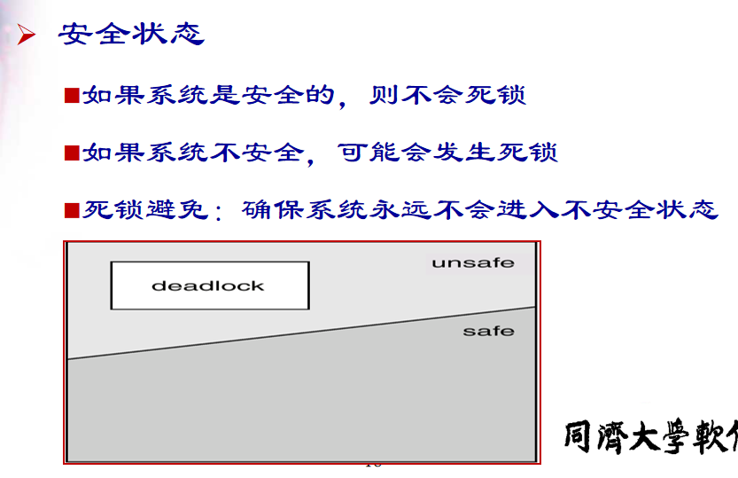

## 死锁
### 产生问题
- 一组阻塞进程分别占有一定的资源并**等待获取**另外一些已经同组**其他进程所占有的资源**
- 资源竞争(非CPU，这个交给调度)**可能**会死锁
### 死锁模型
- 资源：$R_1, R_2,...,R_m$
- 每个资源类型$R_i$有$W_i$个实例
- 每个进程需要通过下述方式利用资源
  - 申请
  - 使用
  - 释放
### 死锁特征
- 特点
  - 资源互斥
  - 持有一个资源并等待另一个资源，而另一个资源被其他占有
  - 非抢占，即资源不能被抢占
  - 循环等待
- 分析
  - **上述四点同时满足，就会引起死锁**
  - 前三点本身属性，而我们能改变的只有最后一个
### 死锁处理方法
#### 死锁预防
- 思路
  - 确保四个条件一个不成立，完全保证不会发生
  - 代价很大，不用
- 问题
  - 互斥：资源本身就不共享，改不了
  - 持有并等待：资源利用率可能比较低，可能发生饥饿
#### 死锁避免
- 思路
  - 增加申请资源分配的相关信息
  - 每申请一次就调用**避免算法**，决定分配否，分配给谁
  - 状态通过**可用资源数量、已分配资源数量、进程最大申请数量**定义
- 问题
  - 申请就调用过于频繁，系统变慢

#### 死锁检测
- 思路
  - 资源有就给，加速申请，判断系统慢了再检测是否死锁
  - 资源图方法
- 判断的是之前的分配好不好
#### 死锁恢复
- 方法
  - 终止进程以释放资源(简单喜欢)
    - 策略
      - 优先级低的
      - 没怎么开始计算工作的
      - 已有资源多的(释放多)
      - 将来要用到资源多的
      - 尽量少就能破坏循环的
      - 交互式的(no 批处理)
  - 资源抢占
    - 策略
      - victim-minimize cost
      - 回滚，重新分配
    - 可能导致饥饿一直被抢占
### 化简
- 先看系统还剩下多少资源没分配，再看有哪些进程是**不阻塞**（“不阻塞”即：系统有足够的空闲资源分配给它）的
- 把**不阻塞的进程的所有边都去掉**，形成一个孤立的点，再把系统分配给这个进程的**资源回收**回来
- 看剩下的进程有哪些是不阻塞的，然后又把它们**逐个变成孤立**的点

- 把分配的资源划掉
- 看还要申请的P3还有资源剩余，即可以分配并运行
- 资源回收，放回去
- 看剩下进程资源申请的还有否剩余