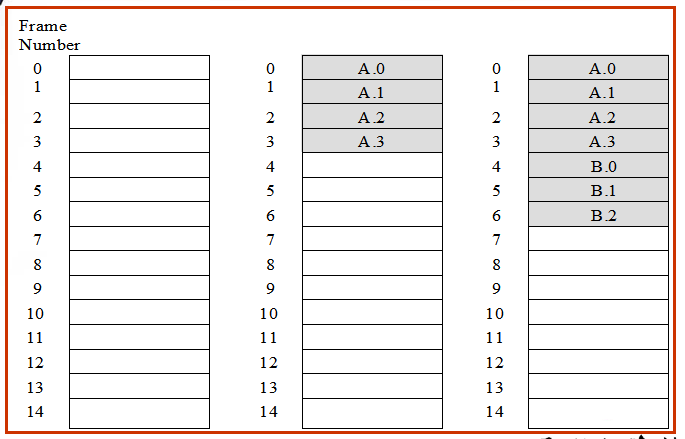
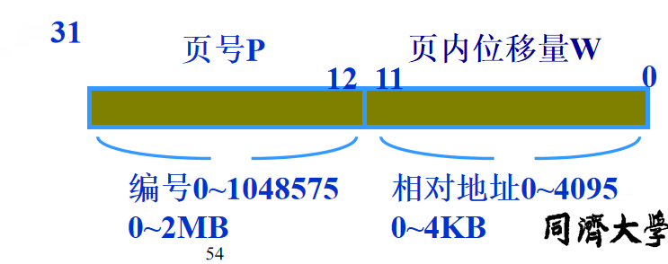
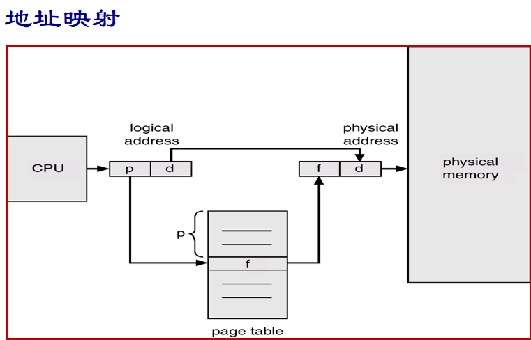
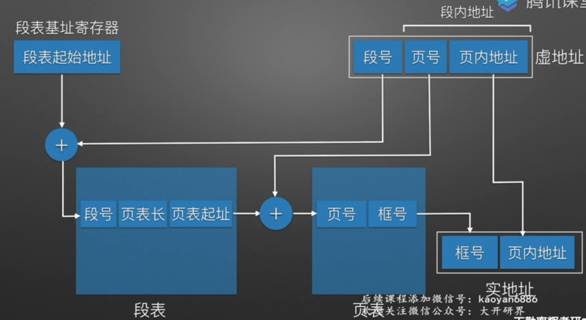
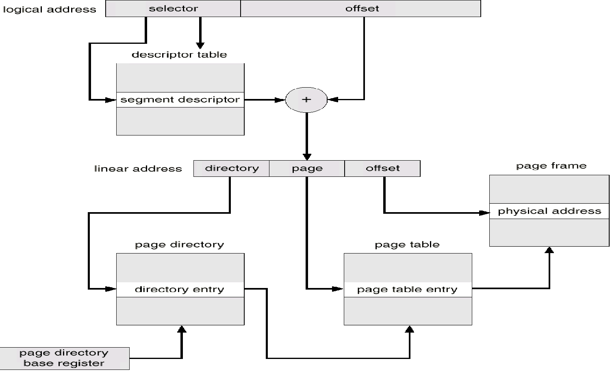

## 内存管理
### 执行前
- 步骤
  - 执行: 双击可执行文件，装入内存使其以进程的方式出现
  - 编译: 翻译成机器能理解的代码，编译成**若干个目标模块**
  - 链接: 将模块连起来，将编译后形成的**一组目标模块**，以及所需**库函数**链接在一起，形成完整装入模块
    - 静态链接: 程序**运行前**，将**各目标模块以及所需函数**链接成为一个完整的装入模块，之后不再拆开
    - 动态链接 先不链接，用到再链接
      - 装入时: 
      - 运行时: 
  - 装入: OS干的**两件事**，将模块装入内存
    - 以什么方式装入内存
    - 装去哪(目标：使得整体上看内存利用率高)
    - 三个空间
      - 名空间(说明描述性)(编译后)
      - 逻辑地址空间/应用程序空间/虚拟空间/相对地址空间/
      - 存储空间/物理空间/真实空间/绝对地址空间
    - 装入技术
      - 地址再定位技术: 将逻辑地址映射到物理内存地址，由OS的装入程序完成
      - 绝对装入技术: 逻辑地址 -> 绝对地址，在执行前，编译链接之时确定执行时访问的实际存储地址
        - 优点: 简单
        - 缺点: 不适于多道程序系统
      - 可重定位装入技术: **装入时**再修改每个重定位地址项，添加**offset**
        - 静态: 装入之前定位好所有地址，不改了
          - 优点: 容易
          - 缺点: 再定位后不能移动，不利于内存有效利用
        - 动态: 装入内存时不修改逻辑地址，执行到这条语句再定位
          - 优点: 内存利用充分；不必连续存放在内存中，增加限长寄存器对应每个区域
          - 缺点: 需要附加硬件支持，实现存储管理的软件算法比较复杂
- 地址表现形式
  - 源程序中：符号
  - 目标模块中：可重定位的地址(需要重定位到物理内存中)
  - 内存映像中：绝对地址

### 存储管理
- 主存：小，贵，快
- 外存：大，慢
- 目的
  - 空间利用率 默认前提(小程序 大空间)
  - 解决程序空间比实际空间大的问题 默认前提(大程序 小空间)
  - 存储保护(进程1不能操作进程2的数据)
  - 方便，申请空间不用管那么多
  - 等等
- 任务
  - **分配与回收**
  - **存储器扩充**
  - 内存共享
  - 内存保护
- 管理方案
  - 连续内存分配方式(用户区)
    - 单一连续存储管理
      - 任务连续存放，只能放一个，淘汰了
    - 分区存储管理
      - 特点
        - 适用于多道程序系统和分时系统
        - 支持多个程序并发执行
      - 问题
        - 内碎片(一个分区中的) & 外碎片(两个分区之间) 
        - 难以进行内存分区的共享
      - 固定分区 
        - 系统/机器一启动，OS将内存划分为固定大小(每个分区大小相不相等不一定，更希望不等)的连续分区，每个区域放一个进程(针对单一连续存储的改进)
        - 对于不同大小分区
          - 一个队列有空就进
          - 多个队列对应不同分区
        - 优点
          - 内存利用率提高
          - 支持多道程序
          - 简单
        - 缺点
          - 程序需预先估计要占用多大内存
          - 内碎片
          - 分区数量固定，限制并发度
      - 动态分区
        - 针对分区总数固定，提出这个，系统/机器启动了先不分区，程序申请了再分区
        - 优点: 没有内碎片(**分配都是合适的大小**)
        - 缺点
          - 有外碎片(没有分配出去但是太小分配不出去)(外碎片总容量回避内碎片小，更好)
          - 管理复杂，分区表动态变化，算法复杂(选择哪个空闲区域放入，注意这里空闲区域并不是分区！)
        - 分区分配算法
          - 最先适配算法
            - 从**头查找**，找到符合要求(容量大于等于所需)的第一个分区
            - 实质
              - 尽可能利用存储区域空闲区，高地址保存较大空闲区，有大要求容易满足
            - 优点
              - 简单
              - 合并相邻空闲区容易(分区表按照地址排序)
            - 缺点
              - 内存分配不均匀
              - 每次都从头找
          - 循环最先适配算法
            - 从**上次分配的分区起**查找（到最后分区时再回到开头），找到符合要求的第一个分区
            - 特点
              - 时间性能好，分区更均匀，但较大空闲不易保留
          - 最佳适配算法
            - 在所有大于或者等于要求分配长度的空闲区中挑选一个最小的分区
            - 分区表按照空闲区从小到大排序
            - 优点: 较大的空闲分区可以保留
            - 缺点
              - 外碎片多
              - 不好合并空闲区，不得已(装不下了)才需要遍历全表
              - 空闲区是按大小而不是按地址顺序排列的 ，因此释放时，要在整个链表上搜索地址相邻的空闲区，合并后，又要插入到合适的位置
          - 最坏适配算法
            - 取所有空闲区中最大的一块，把剩余的块再变成一个新的小一点的空闲区
            - 空闲区大到小排序
            - 优点: 只用找一次，要么成功，要么失败
            - 缺点: 剩余分区会越来越少，无法运行大程序
      - 利用的数据结构: **分区表**
        - 全局记录那个分区放了多少
        - 系统区，OS维护
      - 分区算法的问题
        - 碎片问题
          - 内存中很小空闲块，不足以满足分配需求
          - 解决方法
            - 紧凑技术(早期的，现在内存不用，但是磁盘用，比较花时间)
            - 离散分配方式！
        - 分区保护问题
          - 界限寄存器
            - 定位寄存器&界限寄存器
            - 上下限寄存器
            - 读内存第一件事比较看是否出界
          - 保护键
            - 在CPU加个标志，看读出来的数据是否与CPU中的相同，表示同一个进程
    - 内存扩充技术
      - 针对大程序，小空间
      - 借助大容量的辅存在逻辑上实现内存扩充
      - 技术
        - 覆盖(淘汰了)
          - 程序员分析程序模块化分析(例如A,B不会同时运行)
          - 方法多种多样不统一，程序员麻烦
          - 特点
            - 编程时必须划分程序模块和确定程序模块之间的覆盖关系，增加编程复杂度
            - 从外存装入覆盖文件，以时间延长换取空间节省
        - 交换 
          - 辅存中一块区域作为**交换区**，大程序放一部分进入内存，其他的放入交换区
          - 发现只能一个程序，于是每个程序都放一部分进入内存，提高并发度(相对于分区把整个程序都放进去)
          - 交换方式
            - 整体交换(进程交换)
              - 以整个进程为单位
              - 为了解决内存紧张，提高利用率
            - 部分交换(页面交换、分段交换)
              - 以分页、分段为基础
              - 支持虚拟存储系统
              - 单位更小->影响更小
  - 离散内存分配方式(不带交换，小程序大空间)
    - 分页
    
      - 一启动将内存分为一堆固定大小分区(但是很小，一般4K)，这样的分区成为**页**，给其编号叫**页号**
        - 4K = $2^{12}$对应页内位移最多多大，在32位系统中减去页的大小剩下表示多少个页
    
      - 物理内存中划分的: 实页、物理页号(0/1/2/...)
      - 进程中划分的: 虚页、逻辑页(A0/A1/A2/...)
      - 分配过程
        -  逻辑页号与物理页号的映射问题
        - 发现空闲区域放不下，将进程分为D[0..i]放一个碎片，D[i+1...]放另一个碎片
      - 逻辑相邻，物理可能不相邻，提高内存利用率
      - 每个进程的最后一个逻辑页都有可能存在**内碎片**，因此不将页定得太大，例如一般每个进程的内碎片不超过4K
      - 数据结构
        - 系统为每个进程建立一个页表(内存系统区，属于进程现场信息)，页表给出逻辑页号和物理内存块号相应的关系；(逻辑页号->内存块号的映射)
        - 全局有一个物理页表位图或者其他数据结构(描述物理内存空间的分配使用状况，大小取决于内存中能够容纳多少页，简单但系统空间占用大)、请求表(描述各个进程页表位置和大小，也可以结合如PCB)
      - 硬件
        - 页表始寄存器
        - 页表长度寄存器
        - 联想寄存器——快表
          - 解决需要多次读取内存的问题 缩短查找时间(至少读一次页表，读一次数据)
          - 记录 逻辑页号->物理页号 的映射(拼接过后的) 由此加快映射进程
          - 优先在快表中查，找不到再查页表
    
    CPU完成地址映射的计算操作，从虚拟页号映射到物理页号再和偏移量拼接
      - 觉得占用系统区空间太大了，使用多级页表，只装入目录项(outer-page table)和其中用到的页表项(page of page table)，发现没有了再根据目录项建立新的页表项
        - 时间换空间
        - n级页表需要n+1次读内存
        - 适合虚拟内存，部分装入程序
      - 优点
        - 解决外碎片，内碎片最多4KB
        - 便于管理
      - 缺点
        - 不宜与实现程序共享
        - 不便于动态链接
    - 分段
      - 因为不便于实现**程序共享**，因此不按照4KB划分，而是按照**逻辑语义**划分，划分出来的块一般比页**大**
      - 因为逻辑段不同，因此每段长度不同
      - 内存物理空间被动态划分为**长度不等**的区域，由起始地址和长度确定
      - 段表记录(系统段表、空闲段表)
        - 段号
        - 段首地址
        - 段长度
      - 硬件
        - 段表始址寄存器 正在运行进程的段表开始地址
        - 段表长度寄存器
        - 快表
          - 正在运行的进程的**段表的子集**
      - 优点
        - 便于动态申请内存
        - 管理使用统一化
        - 便于共享
        - 便于动态链接
      - 缺点
        - 外部碎片
    - 发展历程
      从动态分区，这里分的是一个个进程，然后到分段，一个进程划分逻辑段，然后觉得逻辑段划分比较难，干脆统一成分页
    - 页段结合
      - 基本思想
        - 分段然后段内分页
        - 进程空间 段式划分
        - 内存空间 页式管理
      
      
      CPU硬件结构决定先分段再分页，但通常分段只是幌子(把一个进程视为一段)，分页才是重点
      
      ```mermaid
      graph LR
        1[虚拟地址] --段机制--> 2[线性地址] 
        2 --页机制--> 3[物理地址]
      ```