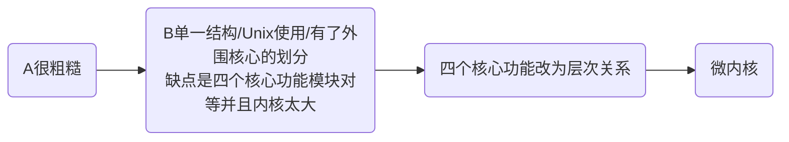
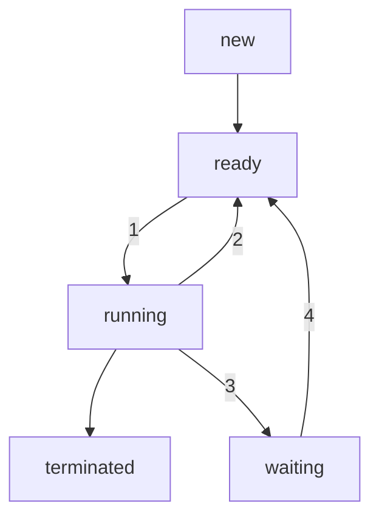

## 概述部分
### OS概念
- 向上服务，向下管理软硬件资源的软件模块，系统软件
- 用户观点：OS是**用户与计算机之间的接口**
- 资源分配器：管理和分配资源
- 控制程序 控制用户程序的执行以及I/O操作
- 内核程序 一直在跑
- 用户和计算机的接口
### OS特征
- **并发(最基本)**：两个或两个以上事件在同一时间间隔内发生
- **共享(最基本)**：系统中的硬件和软件资源可为多个用户同时使用
- 虚拟：物理上的一个实体变成逻辑上的*多个对应物*
- 异步：多个**进程均按照各自独立**的、不可预知的速度向前推进。
### OS设计目标
- ch1
  - 方便性(方便用户使用)
  - 有效性(使用硬件高效)
- ch3
  - 用户
    - OS应该便于使用(方便性)
    - 易于学习
    - 可靠
    - 安全与快速
  - 系统
    - 易设计、实现和维护
    - 应该灵活、可靠、没有错误且高效
### OS发展阶段
$批处理 -> 分时系统 -> \begin{cases}
\text{大型机 并行 服务器端} \\
\text{在分时系统上继续发展 PC端桌面} \\
\text{小型机} \end{cases}$
人工操作 -> 单道批处理 -> 执行系统 -> 多道程序系统
### 组成部分 解决问题?
- 处理机管理(负责对进程进行调度)
- 存储器管理
- 设备管理
- 信息(文件)管理
- 提供用户接口
### 内核技术的发展

始终是核心和外围的边界划分角度的演变
单一结构 -> 核心层次结构 -> 微内核结构
### 什么是微内核
- 只把CPU管理、内存管理等一些基本功能放进内核
- 不是完整的OS
- 微内核结构是以微内核为os核心，以客户/服务器为基础，采用面向对象程序设计特征，是当今最有发展前途的OS结构
### 并发和并行的区别
$CPU \begin{cases}
  并发: \text{用户感觉是并行，CPU中是串行} \\
  并行: \text{多个处理器同在在跑}
  \end{cases}$
### 各个操作系统的特点
- 兼有以下两个或三个功能的OS叫**通用操作系统**
- 实时操作系统
  - 能**及时处理**由过程控制反馈的数据并作出响应
  - 3个
    - 航空订票
    - 过程控制
    - 激光照排系统
  - 首先考虑**实时性、(高)可靠性**，这也是和分时的区别
  - 分类
    - 实时控制系统：以计算机为中心的**生产过程**控制和**活动目标**控制
    - 实时信息处理系统：以计算机为中心的**实时信息查询**系统和**实时事务处理**系统
- 多道批处理操作系统
  - 硬件支持是**通道和中断**
  - 批处理作业**必须有作业控制信息**
  - 允许用户将若干个作业提交给计算机
  - 不允许用户随时干预自己的程序运行
  - 按内存中同时运行的程序数目分类
    - 单道批处理系统
    - 多道批处理系统
  - 希望**平均周转时间**尽可能小
- 分时操作系统
  - 用户也不可以独占计算机资源
  - 分时系统一定有人机交互功能
  - 响应可能不太及时
  - 允许一台电脑上连接多个终端，多个用户可以通过终端同时地交互使用计算机
  - 时间片一定，用户数越多，响应时间越长
  - **时间片轮转**策略为用户服务
  - 三个特征
    - 多路性
    - 交互性
    - 独占性
  - 响应时间
    - 定义：终端用户发出一条命令开始，到系统处理完这条命令并做出回答为止所需的最大时间间隔
    - 主要因素
      - 系统开销
      - 用户数目
      - 时间片
      - 信息对换量
    - 改善
      - **重入码**技术
      - 虚拟存储技术
- 网络操作系统
  - 网络上各**计算机能**方便而有效地**共享网络资源**，为网络用户提供所需的各种**服务的软件和有关规程的集合**
### 作业和进程之间的关系 三道作业批处理系统
- 定义
  - 作业是计算机系统按指定的步骤，为用户**一次上机解题所完成工作的总和**
  - 进程是具有独立功能的可并发执行的程序在一个数据集合上的运行过程
- 系统
  - 作业是批处理系统上概念
  - 进程是多道程序系统上概念
- 组成
  - 一个作业可以由多个进程组成
- 实体
  - 作业是用户向计算机提交的任务实体
  - 进程完成用户任务的执行实体
## 体系结构
### 硬件平台 4种I/O方式
- Programmed I/O，PIO(可编程I/O)
    - CPU定期轮询状态(插电没有、开电源没有...) -> 空循环、忙等待
    - CPU等待慢速的外设传输(慢速外设制约快速CPU)
    - CPU利用率低，不能实现设备间并行
    - 占用CPU时间：查询 + 传输
- 中断机制
    - CPU不主动查询外设状态了，让外设通知CPU(中断请求)
    - 通过**中断控制器**处理中断请求
    - 实现CPU与设备、设备间的并行，CPU利用率高
    - 但传输过程仍然占用CPU时间
- 直接内存存取DMA
    - 增加DMA控制器，控制I/O和内存之间的数据传送，CPU就不用花时间在传输过程上
    - 只用开始结束两个中断请求，告诉CPU准备好了和结束了
    - 提高处理I/O的性能
    - 虽然有中断但中断过程变小了
- 通道技术
    - 多出来一个CPU专门用来处理I/O
    - 提高CPU与设备、设备间的并行度(多核)
    - 用于集成度高的
    - 贵
### 软件平台 微内核结构
- 只把CPU管理、内存管理等一些基本功能放进内核
- 不是完整的OS
- 微内核结构是以微内核为os核心，以客户/服务器为基础，采用面向对象程序设计特征，是当今最有发展前途的OS结构
## 进程管理部分
### 为什么引入进程、线程
- 进程描述程序动态执行时的活动规律和状态变化，使一个在多道程序环境下不能独立运行的程序成为一个**能独立运行**的基本单位，一个能与其他进程并发执行的进程
- 线程好处
  - 资源开销
    - 进程占用资源多，开销大
    - **一个进程内**多个线程共享地址空间以及大部分数据
    - 启动空间花费小
    - 切换时间花费小
      - 说的是**一个进程内的不同线程的切换**否则不仅要切换上下文环境，还要调度目标进程中的某一个线程
  - 通信开销
    - 不同进程之间通过*通信方式*的费时，不易实现
    - **同一个进程**的不同线程间共享，且无需调用内核，但有需要考虑协作关系
### 从调度性、并发性、拥有的资源以及系统的开销等方面 进程和线程的区别
- 调度性：线程在OS 中作为调度和分派的基本单位，进程只作为资源拥有的基本单位。线程切换代价更小
- 并发性：进程可以并发执行,一个进程的多个线程也可并发执行。线程更好并发性，提高系统资源利用率和吞吐率
- 拥有资源：进程始终是拥有资源的基本单位,线程只拥有运行时必不可少的资源，本身基本不拥有系统资源，但可以访问隶属进程的资源.
- 系统开销：操作系统在创建、撤消和切换进程时付出的开销显著大于线程。线程通信无需调用内核， 通信开销更少
### 进程状态迁移图 引起迁移的原因和事件
- 五个状态转换图

- OS在其中响应

- ready -> running的事件
  - 当前执行的进程完成
  - 中断当前优先级低的进程
  - 当前进程时间片到了(分时系统)
  - 当前运行到一半资源不满足(运行到某个指令需要打印机，但没准备好)
- running -> ready
  - 时间片到了
  - 优先级不够，被中断
- running -> waiting
  - 中途缺少资源
- **注意**
  - 没有waiting -> running：对ready队列的不公平
  - 没有ready -> waiting：已经获得的资源不会丢，不然重复申请资源
  - 新建的到直接到就绪，然后运行了才知道缺不缺资源
### 进程组成
PCB + 程序段 + 数据段
两个空就不写PCB
### PCB的含义
PCB 通常是系统内存占用区中的一个**连续存区**，它存放着操作系统用于**描述进程情况**及**控制进程运行**所需的全部信息，它使一个在多道程序环境下不能独立运行的程序成为一个**能独立运行**的基本单位，一个能与其他进程并发执行的进程
### 进程之间的关系
- 一说
  - 竞争
  - 协作
    - 同步：多个合作进程为了完成同一个任务，它们在执行速度上必须相互协调，逻辑上**相互制约**
    - 互斥：进程间因**竞争共享公有资源**而引起的间接制约关系
  - 通信：进程间传输数据、交换信息
- 另一说
  - 无关（有无逻辑关系）
  - 相交
    - 直接作用
      - 同步
      - 通信
    - 间接作用
      - 互斥
      - 共享
### 临界资源
一次只允许一个进程访问的共享资源
### 临界区
进程中**访问临界资源的那段代码**
### 如何实现临界区的互斥访问?
- 使用互斥锁
- 使用信号量
### P/V操作的含义
- P申请资源
- V释放资源
### 信号量的含义
信号量表示资源的实体，是一个与队列有关的整型变量
信号量只能通过初始化和P/V原语来访问
访问信号量的进程，不受进程调度的打断
S>0： 表示有S个资源可用
S=0： 表示无资源可用
S<0： 表示S等待队列中的进程个数
### 如何定义信号量的初值
- 公用信号量用来实现进程间的互斥，初值为1，允许其所联系的一组进程对它执行P/V操作
- 私用信号量用来实现进程间的同步，初值为0或者某个正整数，仅允许拥有它的进程对其执行P/V操作
### 利用P/V操作实现多个进程之间的同步和互斥
- 同步
  - **V下先P上后**
- 互斥
  - **PV夹击**
### 读写问题
```cpp
// reader
while (true) {
  // 读者互斥访问readcount，增加读者
  P(mutex);
    readcount++;
    // 第一个读者进来才判断是否能读
    // 只要有人在读，剩下进来的读者都能读
    if (readcount == 1)
      P(w);// 不给写者进来，但读者能有就进来
  V(mutex);
  READ();
  // 读完了，减少读者
  P(mutex);
    readconnt--;
    // 没有读者了才释放资源，让写者有机会进入
    if (readcount == 0)
      V(w);// 最后的读者出去了，写者才有机会进来
  V(mutex);
}

// writer
while (true) {
  P(w);
  WRITE();
  V(w);
}
```
### 生产者消费者问题
```cpp
// Producer
P(empty);
P(mutex);
  add buffer;
V(mutex);
V(full);
// Consumer
P(full);
P(mutex);
  remove buffer;
V(mutex);
V(empty);
```
### 高级通信方式 send() receive()的工作过程
- send()：将发送进程的数据copy然后*封装规范化*为数据结构'消息'，存储在内存*系统区*
- receive()：将系统区的消息中的数据copy给接收进程
### 常用的调度算法
- FCFS
- SJF
- 优先调度
- 轮转法调度
- 多级队列调度
- 多级反馈队列调度
### 多级反馈队列调度算法分析
对终端用户而言，由于终端型作业用户所提交的作业大都属于**交互性作业，通常短小**，系统只要能使这些作业在**第一队列所规定的时间片内**完成，就满意
对于短批处理作业用户而言，他们的作业开始像终端型作业一样，如果**仅在第一队列中执行一个时间片**即可完成，便可以获得与终端型作业一样的响应时间，对于稍长的作业，通常也**只需要在第二队列、第三队列**中各执行一个时间即可完成，周转时间仍然较短
对于长批处理作业用户而言，他们的**长作业将依次在1, 2,...,直到第n个队列中**运行，然后再按**轮转方式**运行，用户不必担心**其作业长期**得不到处理
### 引起死锁的四个特征
- 资源的互斥性访问
- 非抢占
- 循环等待
- 持有并等待
### 如何针对四个特征克服死锁
#### 死锁预防
- 思路
  - 确保四个条件一个不成立，完全保证不会发生
  - 代价很大，不用
- 问题
  - 互斥：资源本身就不共享，改不了
  - 持有并等待：资源利用率可能比较低，可能发生饥饿
- 资源按序分配策略
#### 死锁避免
- 思路
  - 增加申请资源分配的相关信息
  - 每申请一次就调用**避免算法**，决定分配否，分配给谁
  - 状态通过**可用资源数量、已分配资源数量、进程最大申请数量**定义
- 问题
  - 申请就调用过于频繁，系统变慢
- 银行家算法
#### 死锁检测
- 思路
  - 资源有就给，加速申请，判断系统慢了再检测是否死锁
  - 资源图方法
- 判断的是之前的分配好不好
#### 死锁恢复
- 方法
  - 撤销进程 终止进程以释放资源(简单喜欢)
    - 策略
      - 优先级低的
      - 没怎么开始计算工作的
      - 已有资源多的(释放多)
      - 将来要用到资源多的
      - 尽量少就能破坏循环的
      - 交互式的(no 批处理)
  - 资源剥夺 资源抢占
    - 策略
      - victim-minimize cost
      - 回滚，重新分配
    - 可能导致饥饿一直被抢占
### 资源分配图判定死锁
- 先看系统还剩下多少资源没分配，再看有哪些进程是**不阻塞**（“不阻塞”即：系统有足够的空闲资源分配给它）的
- 把**不阻塞的进程的所有边都去掉**，形成一个孤立的点，再把系统分配给这个进程的**资源回收**回来
- 看剩下的进程有哪些是不阻塞的，然后又把它们**逐个变成孤立**的点
- 把分配的资源划掉
- 看还要申请的P3还有资源剩余，即可以分配并运行
- 资源回收，放回去
- 看剩下进程资源申请的还有否剩余
### 三个层面的调度
- 高级调度、作业调度、宏观调度
  - 时间尺度为分钟、小时或天
- 中级调度
  - 设计内外存交换
- 低级调度、微观调度
  - 毫秒级
  - 从就绪进程/线程中选择进入运行状态
## 内存管理
### 装入内存的方式
- 绝对装入技术
  - 逻辑地址 -> 绝对地址，在执行前，**编译链接之时**确定执行时访问的实际内存地址
    - 优点: 简单
    - 缺点: 不适于多道程序系统
- 可重定位装入技术: **装入时**再修改每个重定位地址项，添加**offset**，可执行文件中列出各个需要重定位的地址单元和相对地址值，装入时再根据所定位的内存地址去修改每个重定位地址项，添加相应偏移量
  - 静态: 装入时将逻辑地址转换为物理地址
    - 优点: 容易
    - 缺点: 再定位后不能移动，不利于内存有效利用
  - 动态: 装入内存时不修改逻辑地址，执行到这条语句再定位
    - 优点: 内存利用充分；不必连续存放在内存中，增加限长寄存器对应每个区域
    - 缺点: 需要附加硬件支持(重定位寄存器)，实现存储管理的软件算法比较复杂
### 动态分区分配中 分区分配算法 如何实现
- 最先适配算法
  - 从**头查找**，找到符合要求(容量大于等于所需)的第一个分区
  - 实质
    - 尽可能利用存储区域空闲区，高地址保存较大空闲区，有大要求容易满足
  - 优点
    - 简单
    - 合并相邻空闲区容易(分区表按照地址排序)
  - 缺点
    - 内存分配不均匀
    - 每次都从头找
- 循环最先适配算法
  - 从**上次分配的分区起**查找（到最后分区时再回到开头），找到符合要求的第一个分区
  - 特点
    - 时间性能好，分区更均匀，但较大空闲不易保留
- 最佳适配算法
  - 在所有大于或者等于要求分配长度的空闲区中挑选一个最小的分区
  - 分区表按照空闲区从小到大排序
  - 优点: 较大的空闲分区可以保留
  - 缺点
    - 外碎片多
    - 不好合并空闲区，不得已(装不下了)才需要遍历全表
    - 空闲区是按大小而不是按地址顺序排列的 ，因此释放时，要在整个链表上搜索地址相邻的空闲区，合并后，又要插入到合适的位置
- 最坏适配算法
  - 取所有空闲区中最大的一块，把剩余的块再变成一个新的小一点的空闲区
  - 空闲区大到小排序
  - 优点: 只用找一次，要么成功，要么失败
  - 缺点: 剩余分区会越来越少，无法运行大程序
### 什么是虚拟存储器 特征 容量如何确定
- 是指具有请求调入功能和置换功能，能从逻辑上对内存容量加以扩充的一种存储器系统
- 特征
  - 不连续性
  - 部分交换
  - 大空间
- 虚拟存储器的最大容量**由计算机的地址结构决定**，目的为**扩充主存容量**或**节省主存空间**，实际容量**内存和硬盘交换区容量之和**；最大页数/段数以及段长度由**逻辑地址结构**决定
### 请求分页技术 两级分页机制?
- 缺页中断
  - 陷入管态，保存现场
  - 找到页面的磁盘位置
  - 内存中有空闲页面?
    - 有就调入
    - 没有就替换算法找空位
  - 修改页表
  - 恢复现场启动进程
- 节省内存
### 页面置换算法 具体实时页面置换过程
- FIFO先进先出
    - 简单
    - 抖动现象->频繁换入换出
    - Belady现象->给更多的页但不一定会有更好的效果
- OPT最佳算法(理想化)
    - 预测未来用未来不再使用的，在离当前最远位置上出现的
- LRU(least recent used)
    - 最常用
    - 利用历史预测将来，置换最长时间没有使用的页
    - 性能接近最佳算法
- LFU最不常用
    - 记录当前访问次数
    - 每一页都设置访问计数器
    - 页中断->换出计数最小的，并**将所有计数清零**
    - 若没有相同的，跟FIFO相同，一直都缺页一直清零，结合FIFO换出
- clock轮转算法
    - 采用一个指针，从当前指针位置开始按地址先后检查各页，寻找use=0的页面作为被置换页，并将指针经过的页修改为use=0 ，最后指针停留在**被置换页的下一个页**
### 什么是快表 其中内容
- 联想**寄存器**——快表
- 解决需要多次读取内存的问题 缩短查找时间(至少读一次页表，读一次数据)
- 快表是页表的子集
- 优先在快表中查，找不到再查页表
### 什么是页表 结构如何
- 系统为每个进程建立一个页表(内存系统区，属于进程现场信息)
- 页表给出逻辑页号和物理内存块号相应的关系；(逻辑页号->内存块号的映射)
### 缓冲池?
## 文件管理
### 文件
信息以一种单元，即文件形式存储在磁盘或其他外部介质上
文件是一组带标识的、在逻辑上有完整意义的信息项的序列
### 文件系统
文件、管理文件的软件及数据结构
- 用户观点
  - 文件系统如何呈现在其面前，如：文件由什么组成、如何命名，如何保护文件、可进行何种操作等
  - **实现对文件的按名存取**
- 操作系统观点
  - 文件目录怎样实现、怎样管理存储空间、文件存储位置、磁盘实际运作方式(与设备管理的接口)等
### 文件系统设计目标
### 文件的逻辑结构、物理结构 如何实现 有何特点
- 逻辑结构
  - 流式文件：
    - 构成文件的基本单位是字符，文件是有逻辑意义的、无结构的一串字符的集合
    - 提供很大的灵活性
  - 记录文件
    - 文件是由若干个记录组成，是一个固定长度记录的序列，每条记录有其内部结构每个记录有一个键，可按键进行查找
- 物理结构--从文件在物理介质上的存放方式
  - 顺序结构
    文件信息存放在若干连续的物理块中
    - 优点
      - 简单
      - 顺序存取、**随机存取**
      - 顺序存取速度快
      - 所需磁盘寻道次数和存到时间最少(磁道相邻/相同)
    - 缺点
      - 不利于文件动态增长
      - 预留空间
      - 重新分配和移动不利于文件的插入删除
      - 外部碎片问题
      - 存储压缩技术
  - 链接结构(隐式)
    每个块末尾隐含指向下一个块的指针，-1标识EOF
    - 优点
        - 提高磁盘空间利用率，不存在外部碎片问题
        - 有利于文件插入删除
        - 有利于文件动态扩充
    - 缺点
        - 存取速度慢，不能**随机存取**
        - 可靠性问题，前面错了后面就没了
        - 更多寻道次数和寻道时间
        - 链接指针占用一定空间
  - 索引结构
    文件信息存放在若干不连续物理块中，系统为每个文件建立一个专用的数据结构**索引表**，并将这些块的块号存放在该索引表中
    一个索引表就是磁盘块地址数组，第i个条目指向文件的第i块
    - 优点
        - 能顺序也能**随机**
        - 满足了满足文件动态增长、插入删除要求
        - 充分利用外存
    - 缺点
        - 较多寻道次数和寻道时间
        - 索引表本身带来系统开销：内外存空间、存取时间
### UNIX系统采用的综合索引方式如何实现 优点
- 索引表中有直接地址直接指向数据块的，也有一级间接地址指向下一级索引表
- 大文件 查找速度
### 磁盘空闲空间管理方法
- 空闲块表
- 空闲块链表
- 位示图
- 成组链接法
### 成组链接法及其优点
- 把空闲块分为若干组，每100个空闲块为一组，每组的第一个(栈底)空闲块记录了空闲块总数和下一组物理空闲块的物理盘块号(递归)
- 克服了空闲链表法表太长的缺点，分配和回收一个盘块比较简单
### 目录文件的组成
为实现对文件目录的管理，通常将文件目录以文件形式保存在外存
### 采用目录文件的目的
高效性、重命名、逻辑组
### 目录的改进方法及其改进性能比较
- 目录项分解：symbol FCB(文件名、文件号...) & basic FCB(文件名所有信息)
- 例如UNIX中的i节点
- 目录能装更多的目录项，更少磁盘I/O
### 常用的目录结构
- 一级目录
- 二级目录
- 树形目录
- 哈希
- B+树
### RAID的概念
廉价磁盘冗余阵列
### RAID的关键技术
- 将数据条带化后，存放在不同磁盘上，通过多磁盘的并行操作提高系统的读写速率
- 使用基于异或运算为基础的校验技术恢复损坏的数据
### 文件操作中Create()/Open()
- Create()
  - 创建文件的FCB，建立必要的存储空间，分配空FCB，根据提供的参数及需要填写有关内容返回一个文件描述
  - 执行过程
    - 检查参数合法性
    - 检查同一目录下有无重名文件
    - 在目录中有无空闲位置
    - 填写目录项内容
    - 返回
- Open()
  - 文件使用前都需要先打开(而非Create())，即把FCB送到内存
  - 执行过程
    - 根据文件路径名查目录，找到FCB主部
    - 根据打开方式、共享说明和用户身份检查访问合法性
    - 根据文件号查系统打开文件表，看文件是否已被打开
      - 是：共享计数+1
      - 否：将外存中的FCB主部等信息填入系统打开文件表空表项，共享计数 = 1
### 影响磁盘访问的因素
- 寻道时间
- 旋转延迟
- 数据传输
### 磁盘调度算法
- 先来先服务(FCFS)
  - 按访问请求到达的先后次序服务
  - 优点：公平简单
  - 缺点：效率不高，相邻两次请求可能造成最外的柱面寻道，使磁头反复移动，增加了服务的时间，对机械不利
- 最短寻道时间优先(SSTF)
  - 优先选择距当前磁头最近的访问请求进行服务，主要考虑寻道优先
  - 优点：改善了磁盘平均服务时间
  - 缺点：造成某些访问请求长期等待不到服务
- 扫描算法(电梯算法，双向扫描)
- 单向扫描算法
### 磁盘调度时间?