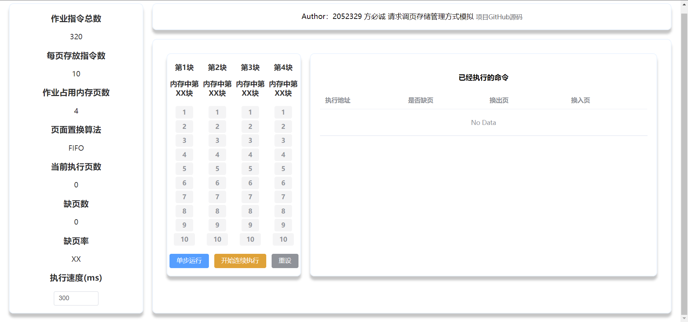
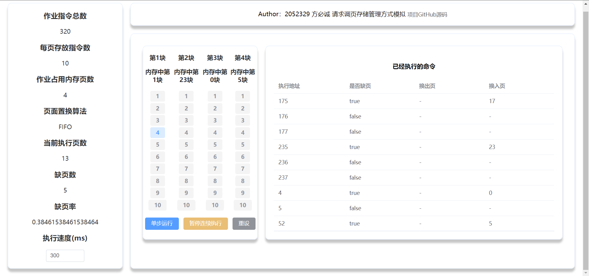
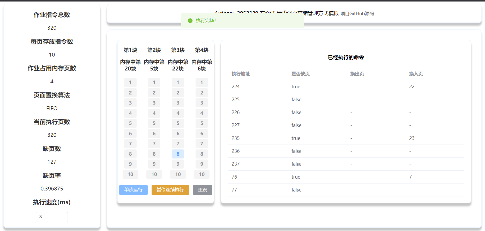

# 请求调页存储管理方式模拟说明文档
## 项目说明

- 基本任务
  - 假设每个页面可存放10条指令，分配给一个作业的内存块为4
  - 模拟一个作业的执行过程
  - 该作业有320条指令（即地址空间为32页），且目前所有页还没有调入内存。

- 模拟过程
  - 在模拟过程中，如果所访问指令在内存中，则显示其物理地址，并转到下一条指令
  - 如果没有在内存中，则发生缺页，此时需要记录缺页次数，并将其调入内存
  - 如果4个内存块中已装入作业，则需进行页面置换
    - 置换算法可以选用FIFO或者LRU算法
  - 所有320条指令执行完成后，计算并显示作业执行过程中发生的缺页率。
  - 作业中指令访问次序要求：
    - 50%的指令顺序执行
    - 25%是均匀分布在前地址部分
    - 25％是均匀分布在后地址部分
## 功能实现

### 主要变量

本项目代码中，主要使用到了如下变量

| 变量名             | 作用                               |
| ------------------ | ---------------------------------- |
| isBeginLoop        | 判断是否开始连续执行               |
| selectedID         | 表示执行命令的地址，以配合高亮显示 |
| totalAssignmentNum | 总指令数（320条）                  |
| instructionPerPage | 每页的指令数（10条）               |
| usePageNum         | 目前已经使用的页数（范围：[0,4]）  |
| usePages           | 目前正在使用的页的数组（Array[4]） |
| curStep            | 当前执行指令数                     |
| missingPage        | 缺页次数                           |
| missingRate        | 缺页率（=missingPage/curStep）     |
| order              | FIFO先入先出                       |
| timePerExecution   | 连续执行指令的间隔（可设置）       |

### 主要函数

- `generateTask()`
  - 目的：产生下一条指令的地址
  - 步骤：
    - 读取上一条指令
      - 若为`undefined`，则表示还未开始执行，直接随机抽取一条
      - 否则，随机random一个数字，并且
        - 50%概率设成下一条
        - 25%概率设成后地址中随机一条
        - 25%概率设成前地址中随机一条
      - 设置上一条指令及`selectedID`，并返回
- `move(pageID, memoryID)`
  - 目的：封装步骤，将`pageID`代表的页移入到内存中地址为`memoryID`的位置
- `jumptoNext(nextAddress)`
  - 目的：根据`nextAddress`，跳转到下一条指令
  - 步骤：
    - 首先查找`nextAddress`是否在内存中
    - 若有，则直接调换
    - 否则，
      - 若内存未被装满，则将新页面装入
      - 否则，按照FIFO算法，将最先进入内存的页面替换
    - 输出相关信息
- `moveOneStep()`
  - 目的：执行一条指令
  - 步骤：在未完成的情况下，调用`jumptoNext(generateTask())`
- `moveForward()`
  - 目的：连续执行指令
  - 步骤：
    - 若未开始连续执行，则设定定时器，按照指定间隔执行`moveOneStep()`
    - 若已开始连续执行，则清除原有定时器。

- `reset()`
  - 目的：重设页面

### 运行逻辑

- 点击`单步执行`按钮，则运行`moveOneStep()`函数，执行一条指令，内存表中对应调用地址的标签会从灰色变成蓝色，右侧表格会输出执行命令的相关信息，包括执行地址，是否缺页，换出页，输入页。若指令已执行完毕，则会给出提示。
- 点击`开始连续执行`按钮，则运行`moveForward()`函数，按指定的执行速度不断执行`moveOneStep()`函数。再次点击（此时提示文字为`暂停连续执行`按钮）则停止执行。若指令已执行完毕，则会给出提示。

- 更改左侧`执行速度`下输入框中的数字，可更改连续执行任务的间隔时间（单位：ms）

## 运行方法

本项目采用Vue+Node.js开发

- 本地访问

  - Project setup

    ```
    npm install
    ```

  -  Compiles and hot-reloads for development

    ```
    npm run serve
    ```
    
  - 完成后可在http://localhost:8080/中访问

- 在线访问

  - 本项目已经部署到`Github Pages`中，访问网址为
  - https://baokker.github.io/page_management_project/

## 运行示意图







## 项目总结

### 项目亮点

- 采用Vue+Node.js开发，可以动态反映内存中运作情况
- 界面采用`element-plus`美化，较为美观
- 可以自己设置执行速度，调整连续执行快慢

### 改进方向

- 增加移动端的适配
- 增加更多算法
