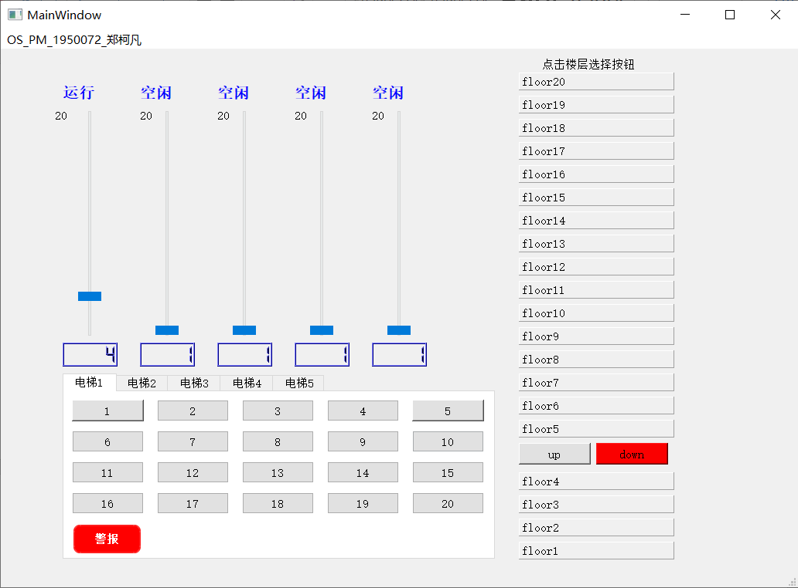
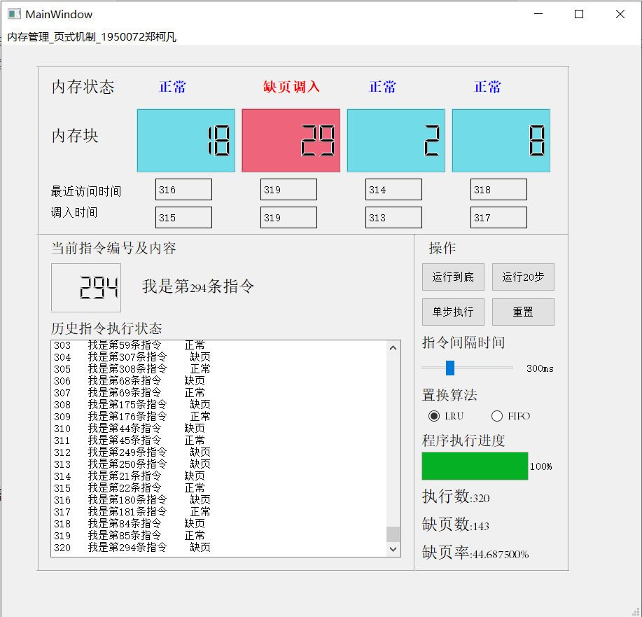
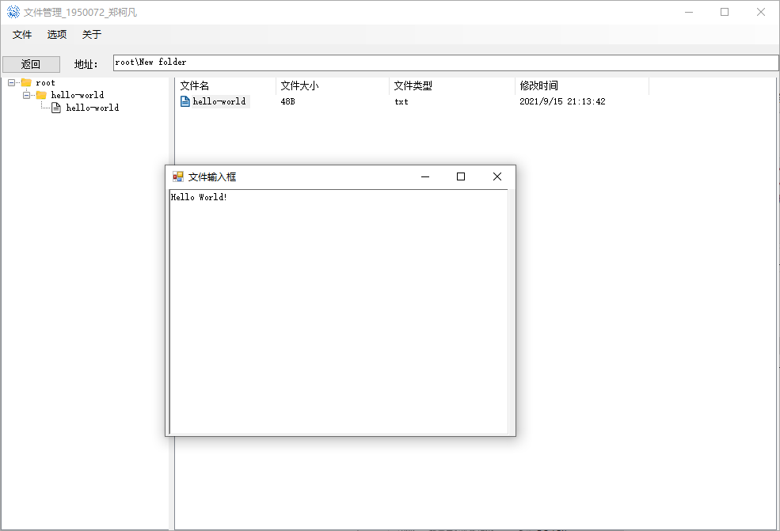

# OS
Operating System Course Project | Tongji University
---
## 项目说明
- [1.进程管理-电梯调度](#1进程管理-电梯调度)
- [2.内存管理-请求调页](#2内存管理-请求调页)
- [3.文件系统](#3文件系统)
---
### 1. 进程管理-电梯调度
某一栋楼共有20层，有5部互相连接的电梯。每个电梯都有一些按键，如：数字楼层键、开门键、关门键、报警键。同时，在每个楼层，5部电梯拥有共享的上行键和下行键。

#### 1.1 基本假设

1. 所有电梯初始状态都在第一层。
2. 每个电梯在没有相应任务的情况下停留在当前楼层。

#### 1.2 基本需求

1. 对于电梯内部的用户，按下电梯内部的数字按键后，数字将会高亮显示给予用户提示，同时电梯将会将用户送达目标楼层。
2. 对于电梯外部的用户，按下楼层中的上行键或下行键后，系统将自动为用户分配电梯资源，尽可能快地前往用户楼层搭载用户。
3. 在电梯内部按下警报键后，整部电梯将会进入维修状态，数码显示屏显示红色高亮提示且整部电梯的内部按键将会失效。
   
---
### 2. 内存管理-请求调页

模拟内存管理中请求调页的存储方式，实现页面、页表、地址间的转换；页面的缺页置换；计算缺页数及缺页率等功能，加深对请求调页系统的原理和实现过程的理解。

#### 2.1 基本假设

1. 每个页面可以存放10条指令。
2. 一个作业分配4个内存块，即一个作业在内存中最多只有4个页面。
3. 一个作业共有320条指令。
4. 开始时所有页都还没有调入内存。

#### 2.2 基本需求

1. 模拟一个作业的执行过程，若所访问的指令在内存中，则显示其物理地址，并转到下一条指令；若所访问的指令不在内存中，即发生缺页情况，则记录缺页次数，并将其调入内存中，如遇内存块已满的情况则还需进行页面置换。
2. 按照50%的指令顺序执行，25%的指令均匀分布在前地址部分，25%的指令均匀分布在后地址部分的原则设置指令访问次序。
3. 一个作业执行完成后，计算并显示作业执行过程中发生的缺页率。

---
### 3.文件系统

文件系统是操作系统中统一管理信息资源的一种软件，管理文件的存储、检索、更新，提供安全可靠的共享和保护手段，并且方便用户使用。对于操作系统而言，文件系统是必不可少的。

#### 3.1 项目目的

1. 理解文件存储空间的管理。
2. 掌握文件的物理结构、目录结构和文件操作。
3. 实现简单的文件系统管理。
4. 加深文件系统实现过程的理解。

#### 3.2 基本需求

1. 在内存中开辟一个空间作为文件存储器，在其上实现一个简单的文件系统。
2. 退出这个文件系统时，需要该文件系统的内容保存到磁盘上，以便下次可以将其回复到内存中来。
3. 采用一定的方式管理文件的物理结构、目录结构以及空闲的空间。
4. 提供如下操作：格式化、创建子目录、删除子目录、显示目录、更改当前目录、创建文件、打开文件、关闭文件、写文件、读文件、删除文件等等。

