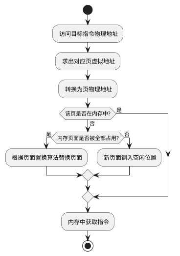

```puml
@startuml
start
: 访问目标指令物理地址;
: 求出对应页虚拟地址;
: 转换为页物理地址;
if (该页是否在内存中?) then (是)
else (否)
    if (内存页面是否被全部占用?) then (是)
        : 根据页面置换算法替换页面;
    else (否)
        : 新页面调入空闲位置;
    endif
endif
: 内存中获取指令;

stop
@enduml

```